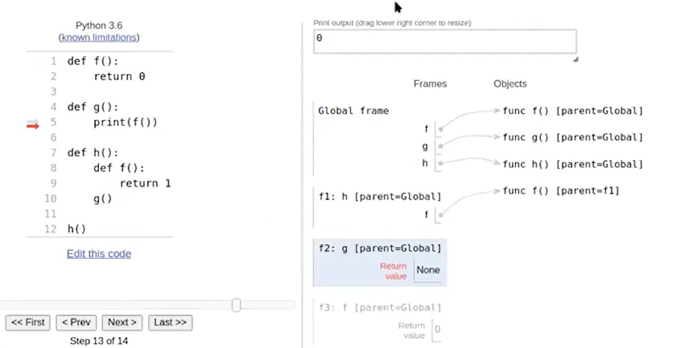

## 定义函数
```python
  def add(x, y):
      return x + y
  # 下面同样是个函数
  def incr(n):
      def f(x):
          return n + x
      return f
  # 使用： incr(5)(6) --> 5+6
```
值得注意的是 后面不需要加标点（加了则表示另外的意思）
**匿名函数**：在定义的时候，不适用def或return关键字的函数。他们通常使---------用 `lambda`表达式创建
```python
lambda arguments: expression
lambda x: x**2 # 返回其平方值，在python中，通过 '**'，表示 次方运算
```
其中，`lambda`是关键字，`arguments`是函数参数，`expression`是函数返回值的表达式
==Attention==:python 中比较注重函数的对齐
1. **print**函数
返回值： None;
可以使用'end'参数指定打印结束时要添加的字符，默然是换行符 '\n'
如
```python
print("Hello", end=" ")
print("world!")
```
结果输出：
`Hello world!`
2. **if**语句
语法：if(condition):
      else:
      elif:
```python
def largest_factor(n):
    for i in range(n - 1, 1, -1):
        if n % i ==0:
            return i
    return 1
```
3. **while**语句
```python
def hailstone(n):
    num = 0
    while (True):
        print(n)
        num = num + 1
        if(n == 1): break
        if n % 2 ==0:
            n = n // 2
        else:
            n = n * 3 + 1
    return num
```
4. **range**语句
`range(start, stop, step)`
注意：
  * 'start'的起始值默认是 0
  * 'stop' **不包含**在序列中
  * 'step' 默认是 1
5. **max** or **min**语句
`max(1, 2, 3) == 3`
6. '/'表示的是浮点数间的除法， '//'表示的是整数间的除法

7. `for`循环
   `for element in iterable:`
    # 迭代操作
    # 对 element 进行操作
  `element` 是在每次迭代中从可迭代对象中获取的元素。
  `iterable`是一个可迭代对象，例如列表、元组、字典、集合或字符串等。
   for 循环的执行过程是依次取出可迭代对象中的每个元素，并将其赋值给 element，然后执行循环体中的代码。在循环体中，可以对 element 进行任何操作，例如打印、处理等。

8. `append()`方法向列表(类似C语言中的数组)添加元素
   ```python
    my_list = [1, 2, 3]
    my_list.append(4)
    print(my_list)  # Output: [1, 2, 3, 4]
  ```

<hr>
> 有关函数作用域的一个小例子，最后打印出: 0


> 打印的也是0


> 打印出的是 1


```python
def f(f):
  f(1) # -----> 这里的f是传入的参数

def g(x):
  print(x)

f(g) # 打印出1
```
## 代码解析
### `int(min(str(score ** 2)))`
1. `**`代表幂次
2. `str(score ** 2)` 指将得到的平方值转换为字符串----str(529) == '529'
3. `min(str(score ** 2))`:找到字符串表示的平方值中的最小字符。由于字符串中的字符按照 ASCII 值进行比较，因此此步骤将返回表示最小数字的字符。
4. `int( '529' )`将找到的最小字符转换回整数

### `and`(就是C语言中的 && )
### `def announce_lead_changes(last_leader=None):`
1. 在 Python 中，函数参数中使用 = 表示参数的默认值。这意味着当调用函数时没有提供相应的参数时，将使用默认值。在您提供的函数签名中，`last_leader=None` 表示 `last_leader` 这个参数的默认值是 `None`。如果调用函数时没有提供 `last_leader` 参数，函数将使用 None 作为默认值。

### `*args`语法：传递任意数量的参数
```python
def my_function(*args):
    # 在函数内部，args 是一个包含所有传递给函数的位置参数的元组（tuple）
    # 在Python中，元组（tuple）是一种有序的、不可变的数据类型，用于存储一组元素。元组的元素可以是任何数据类型（例如整数、浮点数、字符串、元组等），并且可以包含重复的元素。元组使用圆括号 () 表示，元素之间用逗号 , 分隔。
    for arg in args:
        print(arg)

# 调用函数时可以传递任意数量的位置参数
my_function(1, 2, 3, 4, 5)
```
