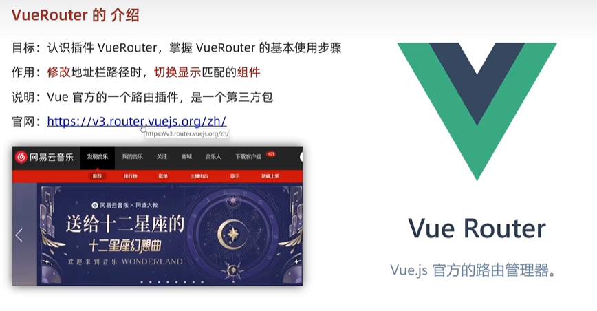
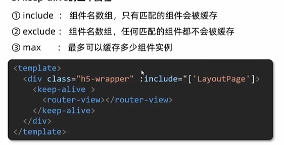

# 常见有用的函数
1. filter（）——作用过滤数组
语法：`array.filter(function(currentValue,index,arr), thisValue)
`

实际用法：
```html
    <div id="app">
        <h3>小黑的书架</h3>
        <ul>
          <li v-for="(item, index) in booksList" :key="item.id">
            <span>{{ item.name }}</span>
            <span>{{ item.author }}</span>
            <!-- 注册点击事件 →  通过 id 进行删除数组中的 对应项 -->
            <button @click="del(item.id)">删除</button>
          </li>
        </ul>
      </div>
      <script src="https://cdn.jsdelivr.net/npm/vue@2/dist/vue.js"></script>
      <script>
        const app = new Vue({
          el: '#app',
          data: {
            booksList: [
              { id: 1, name: '《红楼梦》', author: '曹雪芹' },
              { id: 2, name: '《西游记》', author: '吴承恩' },
              { id: 3, name: '《水浒传》', author: '施耐庵' },
              { id: 4, name: '《三国演义》', author: '罗贯中' }
            ]
          },
          methods: {
            del (id) {
              // console.log('删除', id)
              // 通过 id 进行删除数组中的 对应项 → filter(不会改变原数组)
              // filter: 根据条件，保留满足条件的对应项，得到一个新数组，所以我们要给原来的数组重新赋值。
              // console.log(this.booksList.filter(item => item.id !== id))
              this.booksList = this.booksList.filter(item => item.id !== id)
              // item为传入的参数，箭头函数的逻辑判断 item.id !== id，也就是满足这个逻辑的元素就返回，储存到新数组中
            }
          }
        })
      </script>
```

2. `reduce()`函数 ——用于数组求和
语法：`array.reduce(function(total, currentValue, currentIndex, arr), initialValue)
`


示范：
```js
    var numbers = [65, 44, 12, 4];
 
    function getSum(total, num) {
        return total + num;
        }
    function myFunction(item) {
        document.getElementById("demo").innerHTML = numbers.reduce(getSum,10); //结果是125+10=135
        }
```
解释：
* initialValue(也就是10) 初始值，默认为0——对象的累加必须写0
* 必须传入的参数——函数function


3. `slice()`截取数组（当然也可以是字符串）的函数
语法：`array.slice(start,end)`


<br><hr>
# 第一天

## 01-创建vue实例
创建vue实例，初始化渲染的核心步骤：
1. 准备容器
2. 引包（官网）
3. 创建vue实例 new Vue（）
4. 指定配置项el data => 渲染数据
   * el指定挂载点，选择器指定控制的是哪个盒子（el 会接受个字符串参数，指定盒子）
   * data提供数据
```HTML
    <!-- 
        创建一个vue实例，初始化渲染
        1.准备容器
        2.引包（开发版/生产者包）
        3.创建实例
        4.添加配置 => 完成渲染
     -->

     <div id="app">
        <!-- 这里将来会填写用来渲染的代码逻辑 -->
        {{ msg }}
        <a href="#">{{ count }}</a>
     </div>

     <!-- 引入开发版本包，有更完整的注释和警告 -->
     <script src="https://cdn.jsdelivr.net/npm/vue@2.7.16/dist/vue.js"></script>

     <script>
        // 一旦引入了vuejs核心包，在全局环境，就有了vue构造函数
        const app = new Vue(
            {
                // 通过 el 配置环境，指定vue管理的是哪一个盒子
                el: '#app',
                // 通过data提供数据
                data: {
                    msg: 'hello 你好',
                    count: 666
                }
            }
        )
     </script>
```

演示：


## 02—插值表达式{{ }}
插值表达式是一种vue的模版语法，但是不具备解析标签的能力
1. 作用：利用表达式（是可以被求值的代码，JS引擎会计算出结果）进行差值，渲染到页面中
2. 语法：{{ 表达式 }}
3. 注意点：
    * 使用的数据必须是**存在**的
    * 支撑的是表达式，而非语句，比如：if，for...就不行
    * 不能在标签属性中使用{{ }}插值表达式

```html
 <div id="app">
        {{ nickname.toUpperCase() }}
        {{ nickname+',hello' }}
        <p>{{ age >= 18 ? '成年' : '未成年'}}</p>
        <p>{{ friend.desc }}</p>
    </div>

    <script src="https://cdn.jsdelivr.net/npm/vue@2.7.16/dist/vue.js"></script>

    <script>
        const app = new Vue({
            el:'#app',
            data:{
                nickname:'tony',
                age:18,
                friend: {
                    name:'jepen',
                    desc:'热爱学习 vue',
                }
            }
        })
    </script>
```
## 03-响应式 特性
响应式-数据一旦修改，视图自动更新
```html
    <div id="app">
      {{ msg }}
    </div>

    <script src="https://cdn.jsdelivr.net/npm/vue@2.7.16/dist/vue.js"></script>

    <script>
        const app = new Vue({
            el:'#app',
            data:{
                // 响应式数据——一旦修改数据，视图立马改变
               msg:'你好，黑马',
            }
        })
    // data中的数据是会添加到 实例上的
    // 所以说， 可以通过 实例.属性名 = 新值 来修改数据
    app.msg = '你好,hello';    
    </script>
```

## 04-Vue指令
### 初始指令
为什么会用到指令呢——因为插值表达式不会解析标签
带有v-前缀的特殊标签属性
### v-html
```html
    <div id="app">
        <div v-html="msg"></div>
    </div>

    <script src="https://cdn.jsdelivr.net/npm/vue@2.7.16/dist/vue.js"></script>

    <script>
        const app = new Vue({
            el:'#app',
            data:{
                // 这里用 ``，因为是多行字符串，不能单纯用''                
                msg:`
                <a href="https://www.jd.com/?cu=true">
                京东
                </a>
                `
            }
        })
    </script>
```

效果演示：


### v-show与v-if
v-show（或v-if）=" 表达式 "，表达式值 **true**显示， **false**隐藏
但是二者的原理不同：
1. **v-show**：通过切换CSS的 *display：none* 控制显示隐藏
对应的使用场景：频繁切换显示隐藏的场景
2. **v-if**： 基于 **条件判断**，是否 **创建**或 **移除**元素节点
场景：要么显示，要么隐藏，不会频繁的切换
3. **V-else 和 v-else-if**
作用：辅助v-if
注意：需要紧挨着v-if使用
代码演示：
```HTML 
    <div id="app">
        <p v-if="gender == 1">男</p>
        <p v-else>女</p>
        <hr>
        <p v-if=" score >= 90">A</p>
        <p v-else-i=" score >=70 ">B</p>
        <p v-else-if=" score >=60 ">C</p>
        <p v-else>D</p>
    </div>
    <script src="https://cdn.jsdelivr.net/npm/vue@2.7.16/dist/vue.js"></script>
    <script>
        const app = new Vue({
            el:'#app',
            data:{
               gender: 2,
               score: 75
            }
        })
    </script>
```

演示：


4. **v-on**
作用：注册事件 = 添加监听 + 提供处理逻辑
### 语法1：v-on：事件名 = "内联系语句"
代码演示：
```html
    <div id="happy">
        <button @click = "msg--">-</button>
        <span>{{ msg }}</span>
        <button @click = "msg++">+</button>
    </div>
    <script src="https://cdn.jsdelivr.net/npm/vue@2.7.16/dist/vue.js"></script>

    <script>
        const happy = new Vue({
            el:"#happy",
            data:{
                msg: 100
            }
        })
    </script>
 ```

### 语法2：v-on：事件名 = "methods中的函数名"
用处就是自己可以定义个函数，可以进行更复杂的函数操作
代码片段：

```html
    <div id="happy">
    <button @click = "msg--">-</button>
    <span>{{ msg }}</span>
    <button @click = "fn">+</button>
   </div>
   <script src="https://cdn.jsdelivr.net/npm/vue@2.7.16/dist/vue.js"></script>

    <script>
    const happy = new Vue({
    el:"#happy",
    data:{
        msg: 100
    },
    // 提供处理逻辑函数
    methods: {
        fn(){
    // 这里不可用直接用msg，因为它是happy里面，fn外面的变量
    // 注意所有 methods 中的函数，this 都指向当前实例（也就是happy）    
            happy.msg += 2
        // 写成 this.msg += 2 更好
        }
    }
     })
    </script>
```

**可以简写为：@事件名 = " ... "**

### v-on 调用传参


5. **v-bind**

作用：动态的设置html标签属性 -> scr 、 ulr、title....
**语法**：v-bind:属性名 = "表达式"
```html
    ....
    //也可以简写为
    ...
```

6. **v-for**
作用：基于数据循环，多次渲染整个元素 -> 数组、对象、数字.....

**遍历数组语法**

`v-for = "(item,index) in 数组"`    其中item指每一项，index 下标
代码演示：

```html
    <div id="app">
        <h3>小黑水果店</h3>
        <ul>
            <li v-for="(item,index) in list">
                {{ item }}-{{ index }}
            </li>
        </ul>
    </div>
    <script src="https://cdn.jsdelivr.net/npm/vue@2.7.16/dist/vue.js"></script>
    <script>
        const app = new Vue({
            el:'#app',
            data:{
                list:['西瓜','苹果','鸭梨','榴莲']
            }
        })
    </script>
```

其中，index可以省略

7. **v-for中的key**
语法：`key属性 ="唯一标识"`
作用：给列表添加唯一标识，便于Vue进行列表正常排序复用

8. **v-model指令**
作用：给 *表单元素* 使用， *双向数据绑定* --> 可以快速 获取或设置 表单元素内容（关键是 **双向**变化）
* 数据变换 -> 视图自动更新
* 视图变换 -> 数据自动更新
语法：`v-model = '变量'`

# 第二天

## 指令修饰符
语法：通过`.`指明一些指令的后缀，不同的后缀 封装了不同的函数   ——>简化代码
例如：@keyup.enter  -> 键盘监听回车

## v-bind对样式控制的增强
### -操作class
语法：`:class = "对象/数组"`
1. **对象** ——> 键就是类名，值是布尔值。如果值为true，有这个类；否则没有
```html
    <div class="box" :class="{ 类名1: 布尔值1, 类名2: 布尔值2 }"></div>
```

2. **数组** ——> 数组中的所有类，都会被添加在盒子上。本质上就是一个class列表
```html
    <div class="box" :class="[ 类名1, 类名2, 类名3 ]"></div>
```

### -操作style
语法：`style = "样式对象"`
```html
    <div class="box" :style="{ CSS 属性名1: CSS属性值,  CSS 属性名2: CSS属性值}"></div>
```

## 计算属性
概念：`基于现有的数据，计算出来的新属性。依赖的数据发生变化，自动重新计算`
语法:
1. 声明在 computed配置项中， 一个计算属性对应一个函数
2. 使用起来和普通属性一样使用：{{ 计算属性名 }}。 注意不用加( )


当fullName计算属性，被获取求值时候，执行get（有缓存），会将返回值作为，求值的结果
当fullName计算属性，被修改赋值时候，执行set方法，修改的值会传递给set方法的形参

3. watch 侦听器（监视器）
作用：监视数据的变化，执行一些 业务逻辑或异步操作
语法：
* **简单写法** --> 简答的数据类型，直接监听
```js
    const app = new Vue({
        el: '#app',
        data: {
          words: '',
          obj:{
            word:'',
          }
        },
        // 具体讲解：(1) watch语法 (2) 具体业务实现
        watch:{
            //监听哪个数据就写谁
            //newValue新值,oldValue老值（一般不用，可以省略）
            words (newValue,oldValue){

            },
            // 如果是某个对象的子属性
            // 注意这里加了引号，因为在js中方法名不能直接出现 特殊字符的，如果有，要加上引号
            'obj.word'(newValue,oldValue){

            }
        }

      })
```
* **完整写法** --> 添加额外的配置


完整写法可以同时监视整个对象中的多个数据


## 第三天

### Vue生命周期函数（钩子函数）

```html
  <div id="app">
    <h3>{{ title }}</h3>
    <div>
      <button @click="count--">-</button>
      <span>{{ count }}</span>
      <button @click="count++">+</button>
    </div>
  </div>
  <script src="https://cdn.jsdelivr.net/npm/vue@2.7.16/dist/vue.js"></script>
  <script>
    const app = new Vue({
      el: '#app',
      data: {
        count: 100,
        title: '计数器'
      },
      // 1. 创建阶段 （准备数据）
      beforeCreate () {
        console.log('beforeCreate 响应式数据准备好之前',this.count)
      },
      created(){
        console.log('created 响应式数据准备好之后',this.count);
        // 可以开始发送初始化渲染数据的请求了
        // this.数据名 = 请求回来的数据
      },

      // 2.挂载阶段（渲染模版）
      beforeMount(){
        console.log('beforeMount 模版渲染之前', document.querySelector('h3').innerHTML)
      },
      mounted(){
        console.log('mounted 模版渲染之后', document.querySelector('h3').innerHTML);
        // 可以开始操作dom了

      },

      // 3. 更新阶段 (修改数据  -> 更新视图 )
      beforeUpdate (){
        console.log('beforeUpdate  数据修改了，视图还没修改',document.querySelector('span').innerHTML);
      },

      updated(){
        console.log('updated 数据修改了，视图也修改了',document.querySelector('span').innerHTML);
      },

      // 4. 卸载阶段
      beforeDestroy(){
        console.log('beforeDestroy 卸载前');
      },
      destroyed () {
        console.log('destroyed 卸载后');
      }


    })
  </script>
```

效果演示图：


## 第四天

### .sync修饰符
**作用**:可以实现子组件和父组件数据的`双向绑定`,简化代码
**特点**: prop属性名,可以自定义，非固定为 value
**场景**: 封装弹框类的基础组件， visible属性，true显示，false隐藏
**本质**: 就是 `：属性名` 和 `@update:属性名` 合写
 


### ref和 $refs
1. 获取dom元素
"恰当时机"——> D该OM已经完成渲染  


2. 获取组件实例


### Vue异步更新、$nextTick


## 第五天
### 自定义指令
使用：
`<input v-指令名 type=text>`

自定义指令： 自己定义的指令，可以 **封装一些dom操作**，扩展额外功能
* 全局注册-语法：
`inserted`指的是 当指令所绑定的元素被添加到页面的时候被调用

`el` 就是指令所绑定的元素(形参)

* 局部注册-语法：
只在当前组件范围内使用


### 自定义指令-指令的值


### 自定义指令 -v-loading 指令封装


1. 本质loading效果就是一个蒙层，盖在了盒子上面
2. 数据请求中，开启loading
3. 数据请求完毕，关闭loading


### 插槽-默认插槽
只能插一个'slot'

`<MyDialog>.....</MyDialog>` 里面的写的内容会填充到 `<slot></slot>`z中
**ps**这里的'MyDialog' 是自定义的（组件标签）


### 插槽-后备内容（默认值）


### 插槽-具名插槽


`v-slot:插槽名` 可以简化为 `#插槽名`

### 插槽-作用域插槽

**作用域插槽**：定义 slot 插槽的同时，是可以传值的。给插槽上可以绑定数据，将来使用组件时可以用

（注意：这里的obj是任意起的）

### 单页应用程序
（不会跳转页面）


**比较**：
（SEO搜索引擎优化）

### 路由
**Vue中的路由**：路径 和 组件 的 映射 关系
### VueRouter

使用（5+2）
1. 下载：下载VueRouter模块到当前工程，版本3.6.5（因为目前是vue2）

`yarn add vue-router@3.6.5`
2. 引入
`import VueRouter from 'vue-router'`
3. 安装注册
`Vue.use(VueRouter)`
4. 创建路由对象
`const router = new VueRouter()`
5. 注入，将路由对象注入到new Vue实例中，建立关联
`new Vue ({
  render :h => h(App),
  router
}).$mount('#app') `


## 第六天

### 路由的封装抽离


### 声明式导航-导航链接
需求：实现导航高亮效果


### 声明式导航-两个类名
 
 

 ### 编程式导航
 **如何跳转传参**
 1. **path 路径跳转**
* **query** 传参
```js
    this.$router.push('/路径?参数名1 = 参数值1 & 参数名2 = 参数值2')
    this.$router.push({
    path:'/路径',
    query: {
      参数名1: 参数值1....
    }
    })
```
通过`$route.query.参数名`获取参数

* **动态路由**传参（需要配置动态路由）
```js
  this.$router.push('/路径/参数值')
  this.$router.push({
    path:'/路径/参数值'
  })
```
通过`$route.params.参数名`获取参数


 1. **name命名**跳转
* **query**传参
```js
    this.$router.push({
    name: '路由名字',
    query: {
      参数名1: 参数值1....
    }
    })
```
通过`$route.query.参数名`获取参数
<br>
* **动态路由**传参
```js
  this.$router.push({
    name:'路由名字',
    params:{
      参数名1: 参数值1....
    }
  })
```
通过`$route.params.参数名`获取参数

### 组件缓存keep-alive
问题：在页面跳转时候，数据重新加载了 --> 希望回到原来的位置
原因：路由跳转后，组件被销毁了，返回回来组件又重新构建了，所以数据重新被加载了

解决：使用keep-alive使加载好了的组件缓存


**keep-alive的三个属性**

1. `include`
2. `exclude`
3. `max`
(2024/1/28/16:27)