# async 与 await
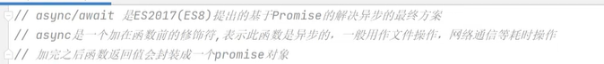
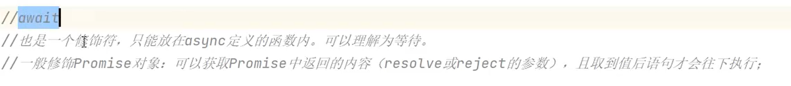

# axios 入门
第一步：npm i -g json-server
第二步：创建数据文件db.json
第三步：json-server --watch db.json (这一步必须和文件在同一个目录下)
   或者 json-server --watch db.json --port 3004

## get请求快速入门
```js
new Vue({
    el: "#app",
    methods: {
      search(){
        // // 方法一：传入对象
        // axios({
        //   method: "GET", // 通过什么方式发请求
        //   url: 'http://localhost:3000/posts' // 路径是什么
        // }).then( res => {
        //   console.log(res)
        // })

        // 方法二：常用写法
        axios.get('http://localhost:3000/posts').then( res => {console.log(res)})
      }
    }
})
```

### 异常处理
```js
new Vue({
    el: "#app",
    methods: {
        search() {
          axios.get('http://localhost:3000/posts')
                .then( res => {
                    console.log(res)}
                ),reason => { // 这里是两个回调函数，一个 then ，一个reason
                  console.log("异常出发")
                  console.log(reason); // 会打印出原因
                }

          // 另一种写法
          axios.get('http://localhost:3000/pos11ts')
              .then( res => {
                console.log(res);
              }).catch( reason => {
                    console.log("异常出发")
                    console.log(reason)
              })
        }
    }
})
```

### 响应对象response结构分析

### 传入数据
```js
add(){
  // 传入数据
  axios.post("/posts",{
    title:"XXX",
    author: "YYY"
  })
  this.search()
}
```

### 


# 常见有用的函数
1. filter（）——作用过滤数组
语法：`array.filter(function(currentValue,index,arr), thisValue)
`

实际用法：
```html
    <div id="app">
        <h3>小黑的书架</h3>
        <ul>
          <li v-for="(item, index) in booksList" :key="item.id">
            <span>{{ item.name }}</span>
            <span>{{ item.author }}</span>
            <!-- 注册点击事件 →  通过 id 进行删除数组中的 对应项 -->
            <button @click="del(item.id)">删除</button>
          </li>
        </ul>
      </div>
      <script src="https://cdn.jsdelivr.net/npm/vue@2/dist/vue.js"></script>
      <script>
        const app = new Vue({
          el: '#app',
          data: {
            booksList: [
              { id: 1, name: '《红楼梦》', author: '曹雪芹' },
              { id: 2, name: '《西游记》', author: '吴承恩' },
              { id: 3, name: '《水浒传》', author: '施耐庵' },
              { id: 4, name: '《三国演义》', author: '罗贯中' }
            ]
          },
          methods: {
            del (id) {
              // console.log('删除', id)
              // 通过 id 进行删除数组中的 对应项 → filter(不会改变原数组)
              // filter: 根据条件，保留满足条件的对应项，得到一个新数组，所以我们要给原来的数组重新赋值。
              // console.log(this.booksList.filter(item => item.id !== id))
              this.booksList = this.booksList.filter(item => item.id !== id)
              // item为传入的参数，箭头函数的逻辑判断 item.id !== id，也就是满足这个逻辑的元素就返回，储存到新数组中
            }
          }
        })
      </script>
```

2. `reduce()`函数 ——用于数组求和
语法：`array.reduce(function(total, currentValue, currentIndex, arr), initialValue)
`


示范：
```js
    var numbers = [65, 44, 12, 4];
 
    function getSum(total, num) {
        return total + num;
        }
    function myFunction(item) {
        document.getElementById("demo").innerHTML = numbers.reduce(getSum,10); //结果是125+10=135
        }
```
解释：
* initialValue(也就是10) 初始值，默认为0——对象的累加必须写0
* 必须传入的参数——函数function


3. `slice()`截取数组（当然也可以是字符串）的函数
语法：`array.slice(start,end)`
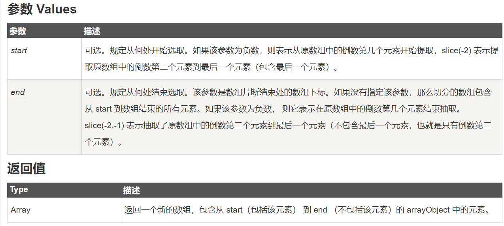

<br><hr>
# 第一天

## 01-创建vue实例
创建vue实例，初始化渲染的核心步骤：
1. 准备容器
2. 引包（官网）
3. 创建vue实例 new Vue（）
4. 指定配置项el data => 渲染数据
   * el指定挂载点，选择器指定控制的是哪个盒子（el 会接受个字符串参数，指定盒子）
   * data提供数据
```HTML
    <!-- 
        创建一个vue实例，初始化渲染
        1.准备容器
        2.引包（开发版/生产者包）
        3.创建实例
        4.添加配置 => 完成渲染
     -->

     <div id="app">
        <!-- 这里将来会填写用来渲染的代码逻辑 -->
        {{ msg }}
        <a href="#">{{ count }}</a>
     </div>

     <!-- 引入开发版本包，有更完整的注释和警告 -->
     <script src="https://cdn.jsdelivr.net/npm/vue@2.7.16/dist/vue.js"></script>

     <script>
        // 一旦引入了vuejs核心包，在全局环境，就有了vue构造函数
        const app = new Vue(
            {
                // 通过 el 配置环境，指定vue管理的是哪一个盒子
                el: '#app',
                // 通过data提供数据
                data: {
                    msg: 'hello 你好',
                    count: 666
                }
            }
        )
     </script>
```

演示：


## 02—插值表达式{{ }}
插值表达式是一种vue的模版语法，但是不具备解析标签的能力
1. 作用：利用表达式（是可以被求值的代码，JS引擎会计算出结果）进行差值，渲染到页面中
2. 语法：{{ 表达式 }}
3. 注意点：
    * 使用的数据必须是**存在**的
    * 支撑的是表达式，而非语句，比如：if，for...就不行
    * 不能在标签属性中使用{{ }}插值表达式

```html
 <div id="app">
        {{ nickname.toUpperCase() }}
        {{ nickname+',hello' }}
        <p>{{ age >= 18 ? '成年' : '未成年'}}</p>
        <p>{{ friend.desc }}</p>
    </div>

    <script src="https://cdn.jsdelivr.net/npm/vue@2.7.16/dist/vue.js"></script>

    <script>
        const app = new Vue({
            el:'#app',
            data:{
                nickname:'tony',
                age:18,
                friend: {
                    name:'jepen',
                    desc:'热爱学习 vue',
                }
            }
        })
    </script>
```
## 03-响应式 特性
响应式-数据一旦修改，视图自动更新
```html
    <div id="app">
      {{ msg }}
    </div>

    <script src="https://cdn.jsdelivr.net/npm/vue@2.7.16/dist/vue.js"></script>

    <script>
        const app = new Vue({
            el:'#app',
            data:{
                // 响应式数据——一旦修改数据，视图立马改变
               msg:'你好，黑马',
            }
        })
    // data中的数据是会添加到 实例上的
    // 所以说， 可以通过 实例.属性名 = 新值 来修改数据
    app.msg = '你好,hello';    
    </script>
```

## 04-Vue指令
### 初始指令
为什么会用到指令呢——因为插值表达式不会解析标签
带有v-前缀的特殊标签属性
### v-html
```html
    <div id="app">
        <div v-html="msg"></div>
    </div>

    <script src="https://cdn.jsdelivr.net/npm/vue@2.7.16/dist/vue.js"></script>

    <script>
        const app = new Vue({
            el:'#app',
            data:{
                // 这里用 ``，因为是多行字符串，不能单纯用''                
                msg:`
                <a href="https://www.jd.com/?cu=true">
                京东
                </a>
                `
            }
        })
    </script>
```

效果演示：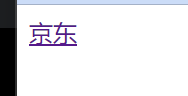


### v-show与v-if
v-show（或v-if）=" 表达式 "，表达式值 **true**显示， **false**隐藏
但是二者的原理不同：
1. **v-show**：通过切换CSS的 *display：none* 控制显示隐藏
对应的使用场景：频繁切换显示隐藏的场景
2. **v-if**： 基于 **条件判断**，是否 **创建**或 **移除**元素节点
场景：要么显示，要么隐藏，不会频繁的切换
3. **V-else 和 v-else-if**
作用：辅助v-if
注意：需要紧挨着v-if使用
代码演示：
```HTML 
    <div id="app">
        <p v-if="gender == 1">男</p>
        <p v-else>女</p>
        <hr>
        <p v-if=" score >= 90">A</p>
        <p v-else-i=" score >=70 ">B</p>
        <p v-else-if=" score >=60 ">C</p>
        <p v-else>D</p>
    </div>
    <script src="https://cdn.jsdelivr.net/npm/vue@2.7.16/dist/vue.js"></script>
    <script>
        const app = new Vue({
            el:'#app',
            data:{
               gender: 2,
               score: 75
            }
        })
    </script>
```

演示：


4. **v-on**
作用：注册事件 = 添加监听 + 提供处理逻辑
### 语法1：v-on：事件名 = "内联系语句"
代码演示：
```html
    <div id="happy">
        <button @click = "msg--">-</button>
        <span>{{ msg }}</span>
        <button @click = "msg++">+</button>
    </div>
    <script src="https://cdn.jsdelivr.net/npm/vue@2.7.16/dist/vue.js"></script>

    <script>
        const happy = new Vue({
            el:"#happy",
            data:{
                msg: 100
            }
        })
    </script>
 ```

### 语法2：v-on：事件名 = "methods中的函数名"
用处就是自己可以定义个函数，可以进行更复杂的函数操作
代码片段：

```html
    <div id="happy">
    <button @click = "msg--">-</button>
    <span>{{ msg }}</span>
    <button @click = "fn">+</button>
   </div>
   <script src="https://cdn.jsdelivr.net/npm/vue@2.7.16/dist/vue.js"></script>

    <script>
    const happy = new Vue({
    el:"#happy",
    data:{
        msg: 100
    },
    // 提供处理逻辑函数
    methods: {
        fn(){
    // 这里不可用直接用msg，因为它是happy里面，fn外面的变量
    // 注意所有 methods 中的函数，this 都指向当前实例（也就是happy）    
            happy.msg += 2
        // 写成 this.msg += 2 更好
        }
    }
     })
    </script>
```

**可以简写为：@事件名 = " ... "**

### v-on 调用传参
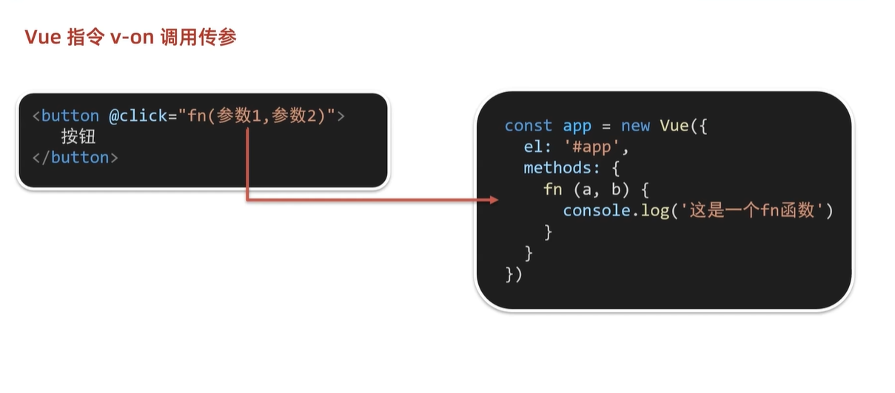

5. **v-bind**

作用：动态的设置html标签属性 -> scr 、 ulr、title....
**语法**：v-bind:属性名 = "表达式"
```html
    ....
    //也可以简写为
    ...
```

6. **v-for**
作用：基于数据循环，多次渲染整个元素 -> 数组、对象、数字.....

**遍历数组语法**

`v-for = "(item,index) in 数组"`    其中item指每一项，index 下标
代码演示：

```html
    <div id="app">
        <h3>小黑水果店</h3>
        <ul>
            <li v-for="(item,index) in list">
                {{ item }}-{{ index }}
            </li>
        </ul>
    </div>
    <script src="https://cdn.jsdelivr.net/npm/vue@2.7.16/dist/vue.js"></script>
    <script>
        const app = new Vue({
            el:'#app',
            data:{
                list:['西瓜','苹果','鸭梨','榴莲']
            }
        })
    </script>
```

其中，index可以省略

7. **v-for中的key**
语法：`key属性 ="唯一标识"`
作用：给列表添加唯一标识，便于Vue进行列表正常排序复用

8. **v-model指令**
作用：给 *表单元素* 使用， *双向数据绑定* --> 可以快速 获取或设置 表单元素内容（关键是 **双向**变化）
* 数据变换 -> 视图自动更新
* 视图变换 -> 数据自动更新
语法：`v-model = '变量'`

# 第二天

## 指令修饰符
语法：通过`.`指明一些指令的后缀，不同的后缀 封装了不同的函数   ——>简化代码
例如：@keyup.enter  -> 键盘监听回车

## v-bind对样式控制的增强
### -操作class
语法：`:class = "对象/数组"`
1. **对象** ——> 键就是类名，值是布尔值。如果值为true，有这个类；否则没有
```html
    <div class="box" :class="{ 类名1: 布尔值1, 类名2: 布尔值2 }"></div>
```

2. **数组** ——> 数组中的所有类，都会被添加在盒子上。本质上就是一个class列表
```html
    <div class="box" :class="[ 类名1, 类名2, 类名3 ]"></div>
```

### -操作style
语法：`style = "样式对象"`
```html
    <div class="box" :style="{ CSS 属性名1: CSS属性值,  CSS 属性名2: CSS属性值}"></div>
```

## 计算属性
概念：`基于现有的数据，计算出来的新属性。依赖的数据发生变化，自动重新计算`
语法:
1. 声明在 computed配置项中， 一个计算属性对应一个函数
2. 使用起来和普通属性一样使用：{{ 计算属性名 }}。 注意不用加( )


当fullName计算属性，被获取求值时候，执行get（有缓存），会将返回值作为，求值的结果
当fullName计算属性，被修改赋值时候，执行set方法，修改的值会传递给set方法的形参

3. watch 侦听器（监视器）
作用：监视数据的变化，执行一些 业务逻辑或异步操作
语法：
* **简单写法** --> 简答的数据类型，直接监听
```js
    const app = new Vue({
        el: '#app',
        data: {
          words: '',
          obj:{
            word:'',
          }
        },
        // 具体讲解：(1) watch语法 (2) 具体业务实现
        watch:{
            //监听哪个数据就写谁
            //newValue新值,oldValue老值（一般不用，可以省略）
            words (newValue,oldValue){

            },
            // 如果是某个对象的子属性
            // 注意这里加了引号，因为在js中方法名不能直接出现 特殊字符的，如果有，要加上引号
            'obj.word'(newValue,oldValue){

            }
        }

      })
```
* **完整写法** --> 添加额外的配置


完整写法可以同时监视整个对象中的多个数据


# 第三天

### Vue生命周期函数（钩子函数）
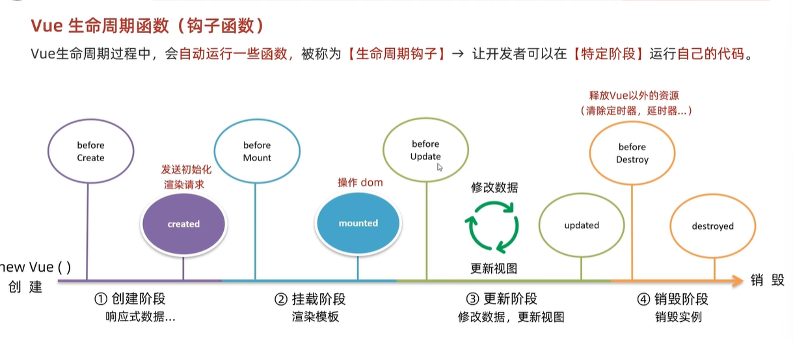
```html
  <div id="app">
    <h3>{{ title }}</h3>
    <div>
      <button @click="count--">-</button>
      <span>{{ count }}</span>
      <button @click="count++">+</button>
    </div>
  </div>
  <script src="https://cdn.jsdelivr.net/npm/vue@2.7.16/dist/vue.js"></script>
  <script>
    const app = new Vue({
      el: '#app',
      data: {
        count: 100,
        title: '计数器'
      },
      // 1. 创建阶段 （准备数据）
      beforeCreate () {
        console.log('beforeCreate 响应式数据准备好之前',this.count)
      },
      created(){
        console.log('created 响应式数据准备好之后',this.count);
        // 可以开始发送初始化渲染数据的请求了
        // this.数据名 = 请求回来的数据
      },

      // 2.挂载阶段（渲染模版）
      beforeMount(){
        console.log('beforeMount 模版渲染之前', document.querySelector('h3').innerHTML)
      },
      mounted(){
        console.log('mounted 模版渲染之后', document.querySelector('h3').innerHTML);
        // 可以开始操作dom了

      },

      // 3. 更新阶段 (修改数据  -> 更新视图 )
      beforeUpdate (){
        console.log('beforeUpdate  数据修改了，视图还没修改',document.querySelector('span').innerHTML);
      },

      updated(){
        console.log('updated 数据修改了，视图也修改了',document.querySelector('span').innerHTML);
      },

      // 4. 卸载阶段
      beforeDestroy(){
        console.log('beforeDestroy 卸载前');
      },
      destroyed () {
        console.log('destroyed 卸载后');
      }


    })
  </script>
```

效果演示图：
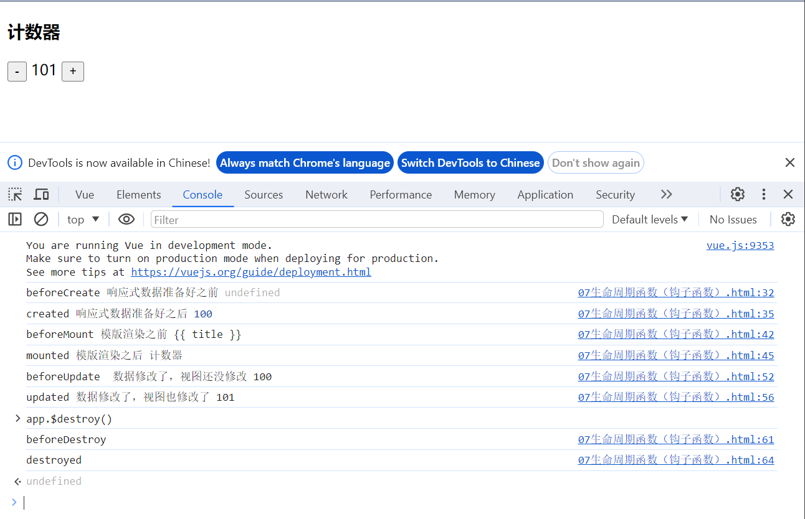


# 第四天

### .sync修饰符
**作用**:可以实现子组件和父组件数据的`双向绑定`,简化代码
**特点**: prop属性名,可以自定义，非固定为 value
**场景**: 封装弹框类的基础组件， visible属性，true显示，false隐藏
**本质**: 就是 `：属性名` 和 `@update:属性名` 合写
 


### ref和 $refs
1. 获取dom元素
"恰当时机"——> D该OM已经完成渲染  


2. 获取组件实例
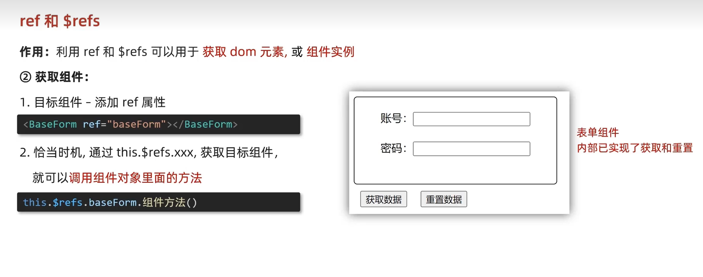

### Vue异步更新、$nextTick
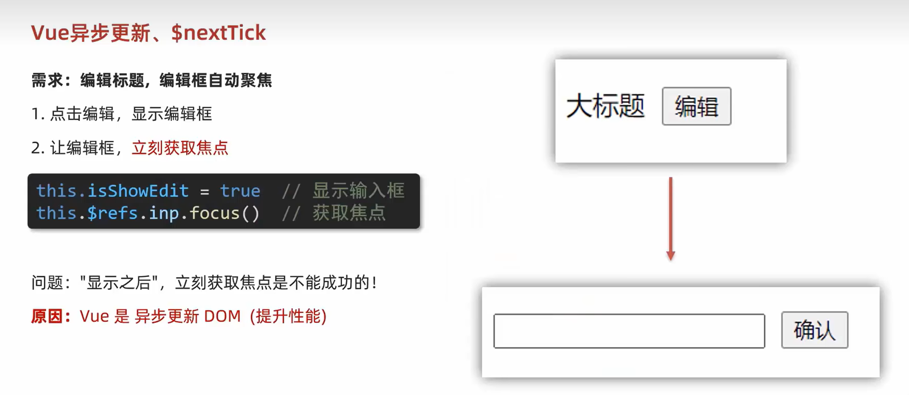


# 第五天
### 自定义指令
使用：
`<input v-指令名 type=text>`
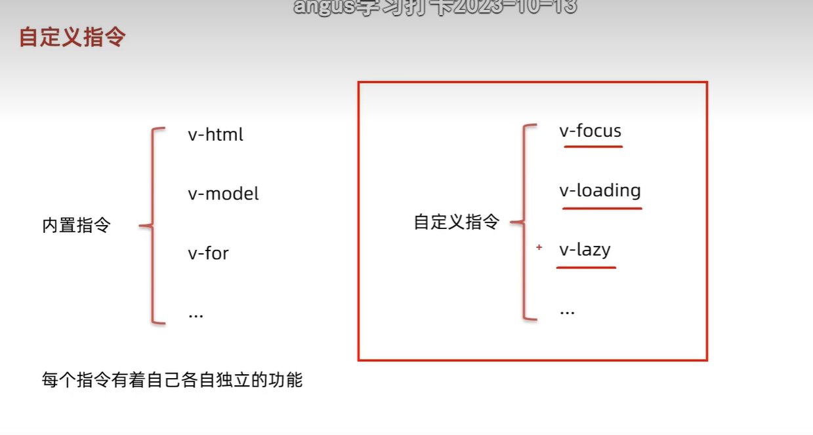
自定义指令： 自己定义的指令，可以 **封装一些dom操作**，扩展额外功能
* 全局注册-语法：
`inserted`指的是 当指令所绑定的元素被添加到页面的时候被调用

`el` 就是指令所绑定的元素(形参)

* 局部注册-语法：
只在当前组件范围内使用
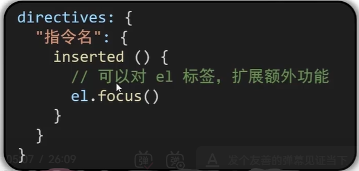

### 自定义指令-指令的值


### 自定义指令 -v-loading 指令封装

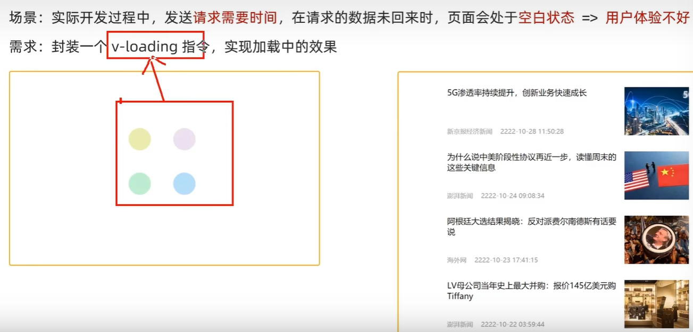
1. 本质loading效果就是一个蒙层，盖在了盒子上面
2. 数据请求中，开启loading
3. 数据请求完毕，关闭loading
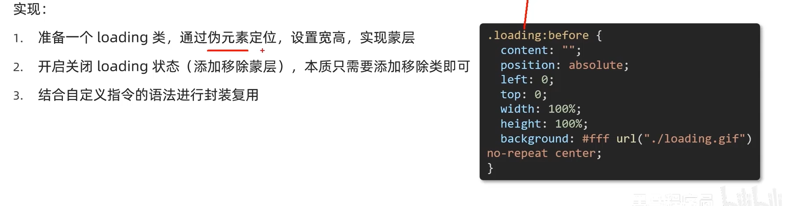

### 插槽-默认插槽
只能插一个'slot'
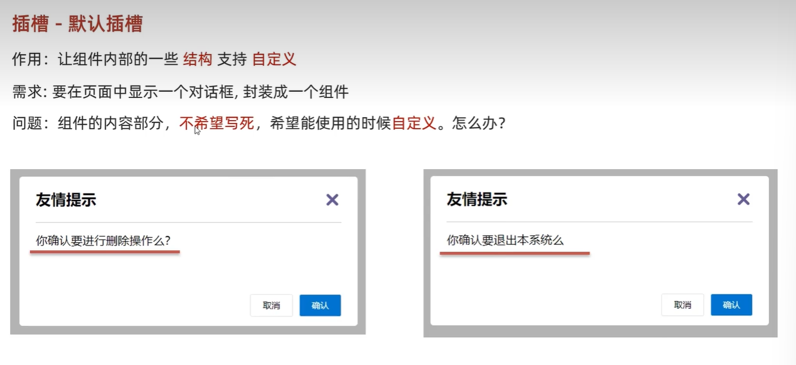
`<MyDialog>.....</MyDialog>` 里面的写的内容会填充到 `<slot></slot>`z中
**ps**这里的'MyDialog' 是自定义的（组件标签）
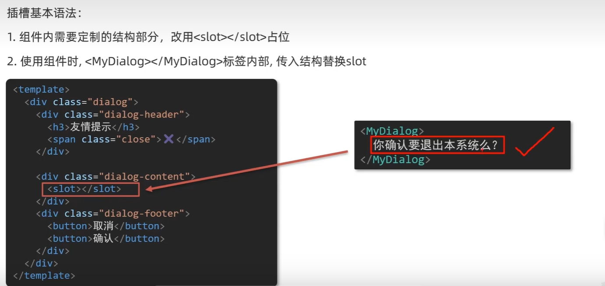

### 插槽-后备内容（默认值）


### 插槽-具名插槽
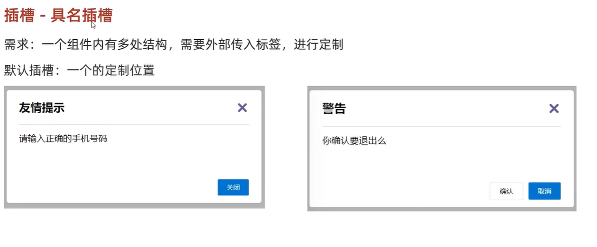
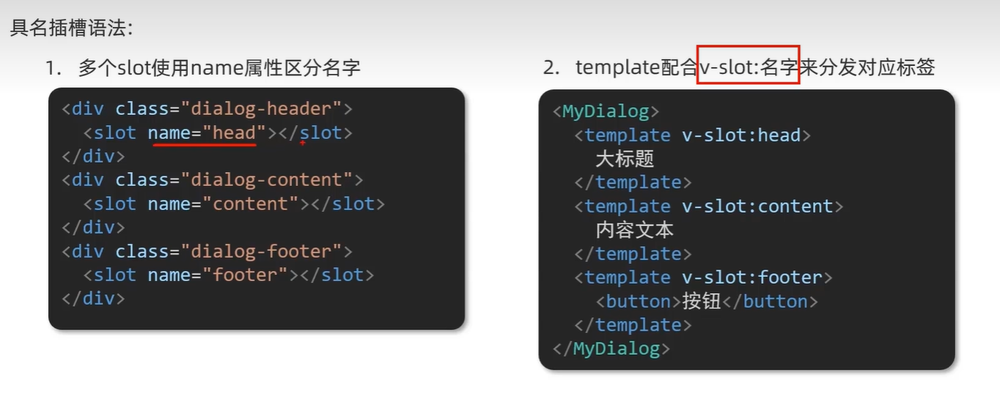
`v-slot:插槽名` 可以简化为 `#插槽名`

### 插槽-作用域插槽
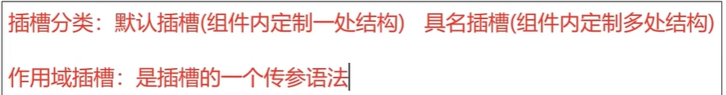
**作用域插槽**：定义 slot 插槽的同时，是可以传值的。给插槽上可以绑定数据，将来使用组件时可以用

（注意：这里的obj是任意起的）

### 单页应用程序
（不会跳转页面）


**比较**：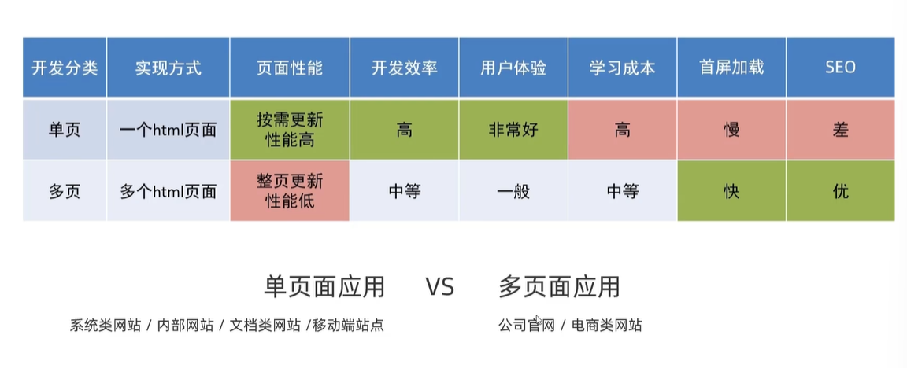
（SEO搜索引擎优化）

### 路由
**Vue中的路由**：路径 和 组件 的 映射 关系
### VueRouter

使用（5+2）
1. 下载：下载VueRouter模块到当前工程，版本3.6.5（因为目前是vue2）

`yarn add vue-router@3.6.5`
2. 引入
`import VueRouter from 'vue-router'`
3. 安装注册
`Vue.use(VueRouter)`
4. 创建路由对象
`const router = new VueRouter()`
5. 注入，将路由对象注入到new Vue实例中，建立关联
`new Vue ({
  render :h => h(App),
  router
}).$mount('#app') `


# 第六天

### 路由的封装抽离
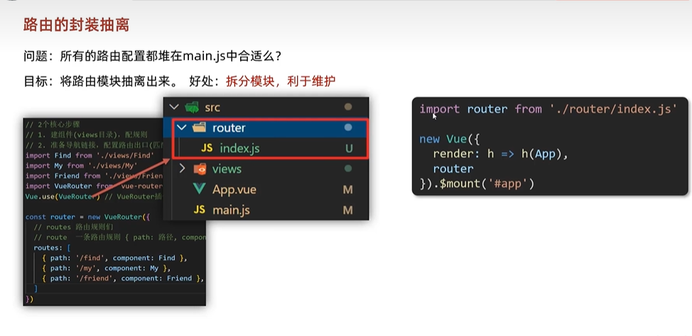

### 声明式导航-导航链接
需求：实现导航高亮效果


### 声明式导航-两个类名
 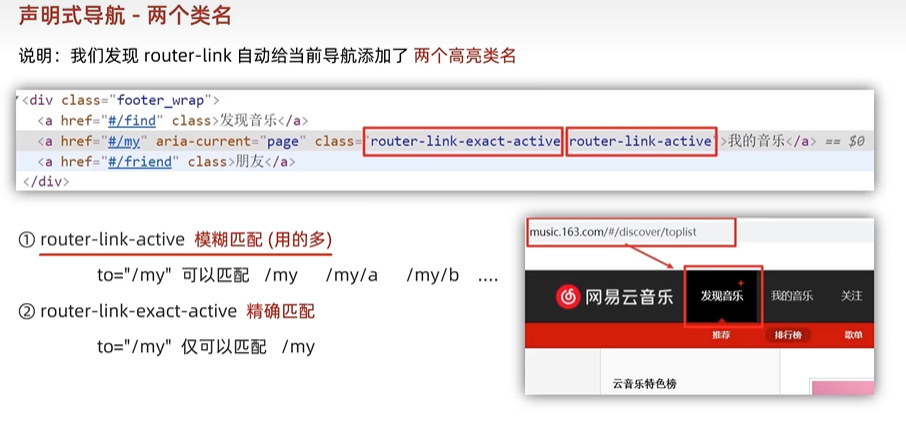
 

 ### 编程式导航
 **如何跳转传参**
 1. **path 路径跳转**
* **query** 传参
```js
    this.$router.push('/路径?参数名1 = 参数值1 & 参数名2 = 参数值2')
    this.$router.push({
    path:'/路径',
    query: {
      参数名1: 参数值1....
    }
    })
```
通过`$route.query.参数名`获取参数

* **动态路由**传参（需要配置动态路由）
```js
  this.$router.push('/路径/参数值')
  this.$router.push({
    path:'/路径/参数值'
  })
```
通过`$route.params.参数名`获取参数


 1. **name命名**跳转
* **query**传参
```js
    this.$router.push({
    name: '路由名字',
    query: {
      参数名1: 参数值1....
    }
    })
```
通过`$route.query.参数名`获取参数
<br>
* **动态路由**传参
```js
  this.$router.push({
    name:'路由名字',
    params:{
      参数名1: 参数值1....
    }
  })
```
通过`$route.params.参数名`获取参数

### 组件缓存keep-alive
问题：在页面跳转时候，数据重新加载了 --> 希望回到原来的位置
原因：路由跳转后，组件被销毁了，返回回来组件又重新构建了，所以数据重新被加载了

解决：使用keep-alive使加载好了的组件缓存


**keep-alive的三个属性**

1. `include`
2. `exclude`
3. `max`
(2024/1/28/16:30)

### 自定义创建项目
#### 第一步：安装脚手架
#### 第二步：创建项目

#### 第三步：选择自定义
选择第三个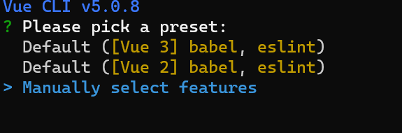
上下调位置，空格确定勾选或取消勾选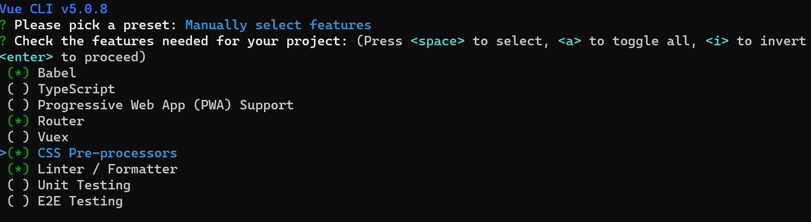


### ESlint 代码规范

目标：认识代码规范
可手动矫正[去ESLint 规则表中查找]，也可以自动矫正（通过插件-ESLint）

### vuex概述
1. 是什么：
vuex 是vue 的一个插件，帮我们管理 vue 通用的数据

### 构建vuex环境
1. 创建项目
2. 创建三个组件
3. 导入

### 操作
1. 安装vuex`yarn add vuex@3`
2. 新建vuex模块文件
新建store/index.js 专门放vuex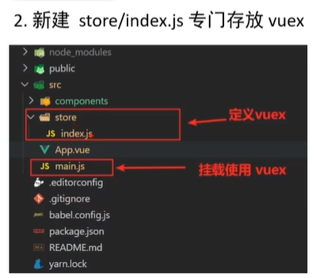
3. 创建仓库`new Vuex.Store()`
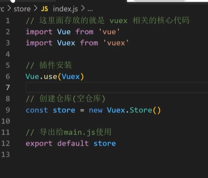
4. main.js导入挂载
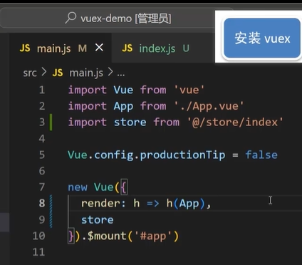

**state状态**
1. **提供数据**
```js
  // 创建仓库
  const store = new.Vuex.Store({
  // state 状态，即数据，类似于vue组件中的data
  // 区别：
  //data： 是组件自己的数据
  // state 是所有组件共享的数据
  state : {
    count: 101
  }
  })
```
2. **使用数据**
* 方法一：通过store直接访问
  `this.$store`
  `import 导入 store`
  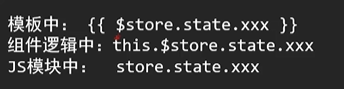
ps:模版中，`<template></template>`；组件逻辑中，`<script></script>`中；js模块中，`main.js`中

* 方法二：通过辅助函数（简化）
**mapState**是辅助函数，会帮我们把store中的数据自动映射到组件的 计算属性 中的函数
1. 导入mapState
`import { mapState } from 'vuex'`
2. 数组方式引入state
3. 展开运算符映射
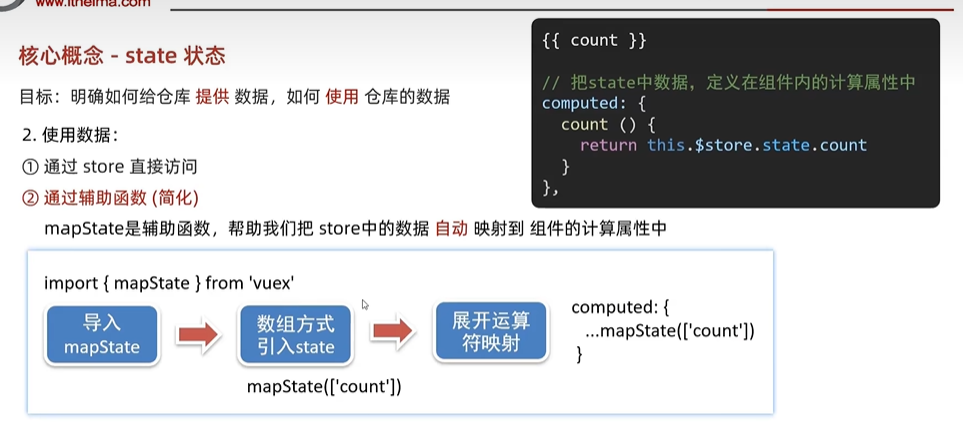

(... 是展开运算符)

**mutations**
目标:明确vuex 同样遵循单向数据流，组件中不可以==直接==修改仓库的数据
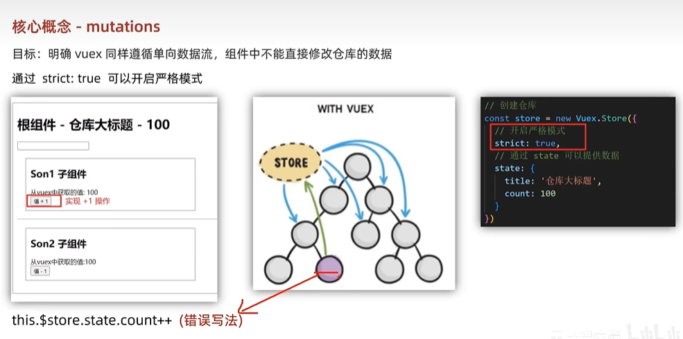

**如何修改呢？**  
通过mutations修改！——定义 mutations 对象，对象中存放修改state的方法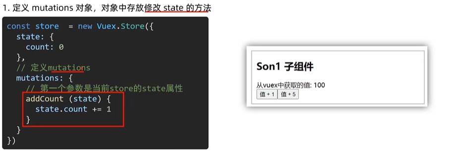
然后组件中，需要调用mutation
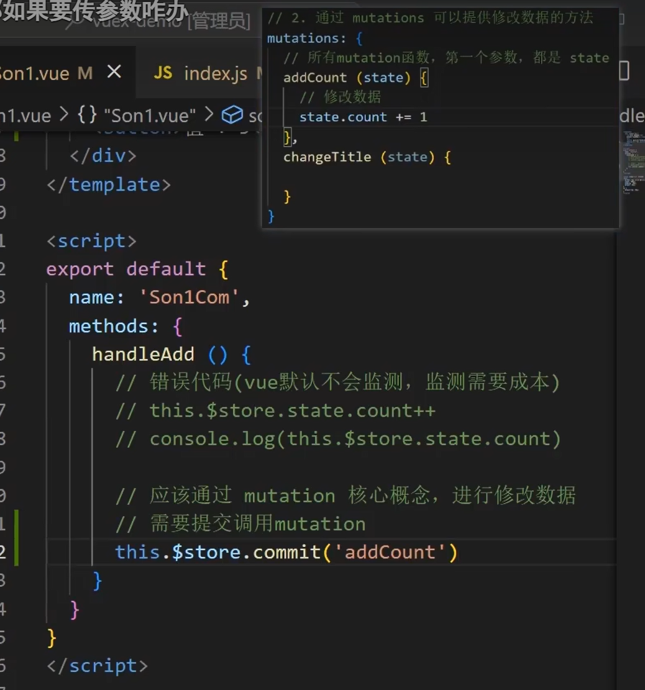

**mutations 传参语法**

语法：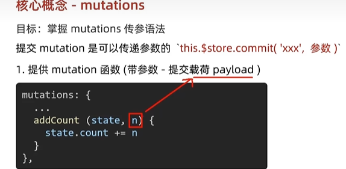
也可以传递多个参数，或者是数组

### 辅助函数：mapMutations
mapMutations 和 mapState 很像，它是把位于 mutations 中的方法提取出来，映射到组件 methods 中（等价于在methods中写）
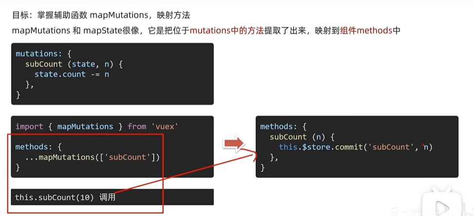

### actions-处理异步操作
（mutations 必须是同步的，便于监视数据变化）
1. 提供 action 方法
`context` 上下文（此处未分模块，可以当做仓库）
这里是 setTimeout 模拟异步，以后大部分是发请求
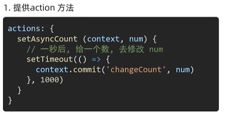 先异步处理了数据，再提交
1. 页面中 dispatch 调用传参
   `this.$store.dispatch('setAsyncCount',200)`

### 辅助函数-mapActions
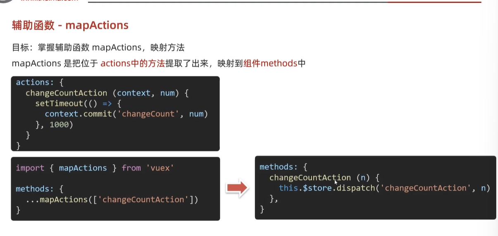

### getters
类似于计算属性
1. 定义getters
 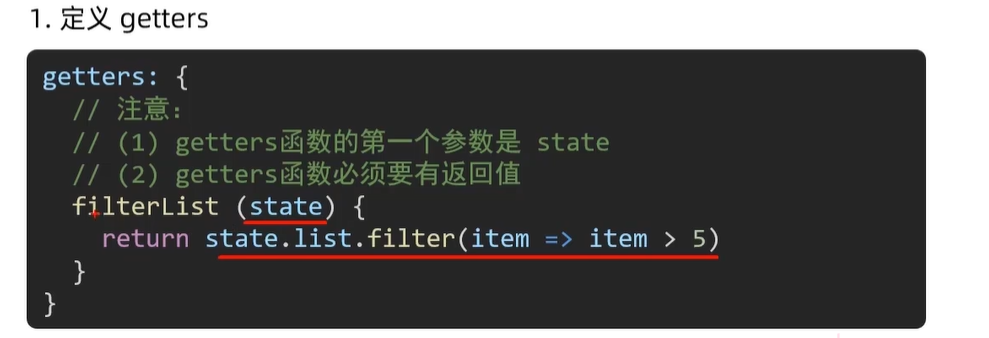
2. 访问getters
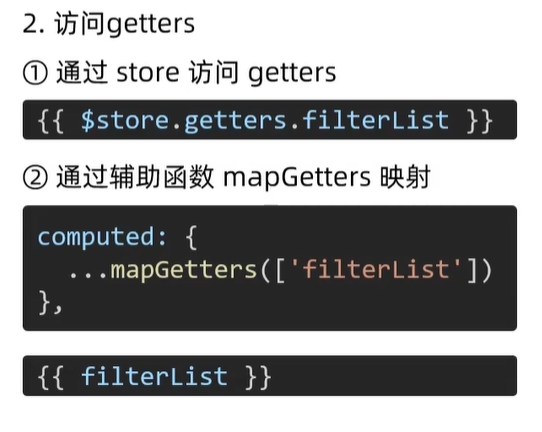

### module(进阶语法)
由于 vuex 使用单一状态树，应用的所有状态会集中到一个较大的对象。当应用变得复杂是，store就会变得相当臃肿。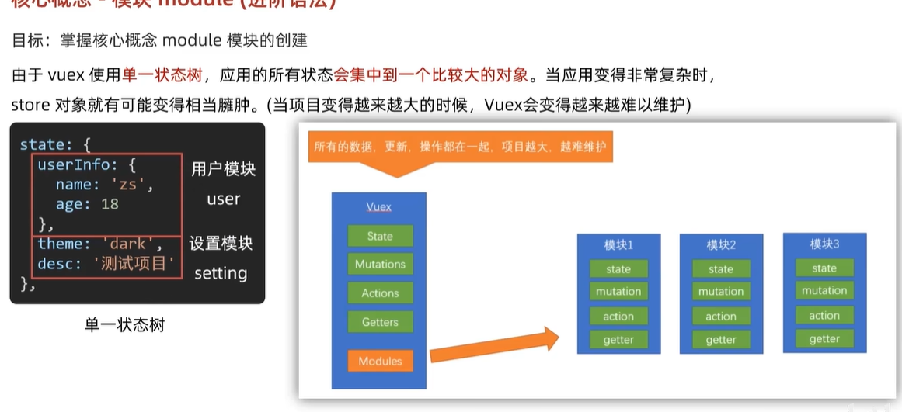
**模块拆分**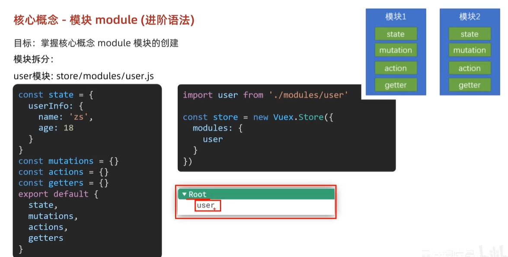

## vue2大项目-电商shopping
### 第一步--->创建项目（自定义）
### 第二步--->将一些没用的文件删除，或增添
### 第三步--->认识第三方组件库（vant-ui）
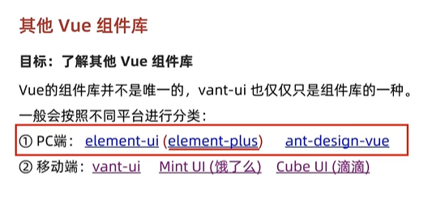

1. Vue2 项目，安装vant 2
   `npm i vant@latest-v2`
2. 导入（在官网上看）
   * 按需导入（推荐）
  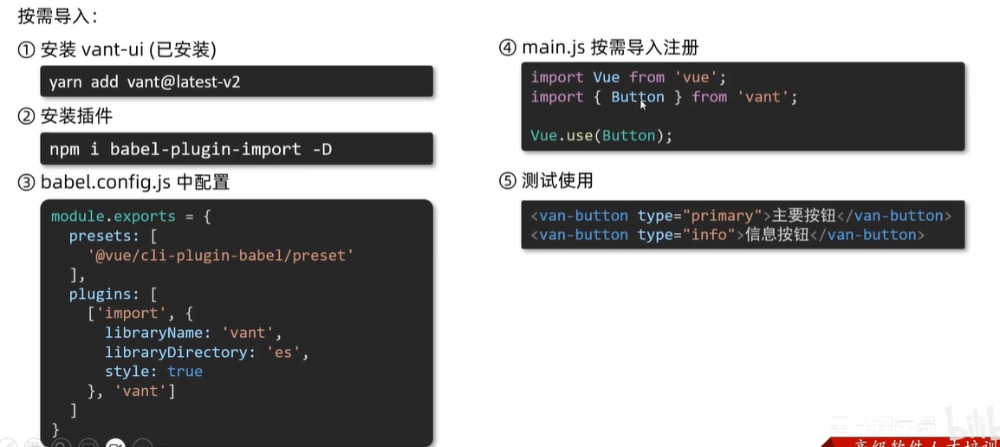
   * 全部导入
  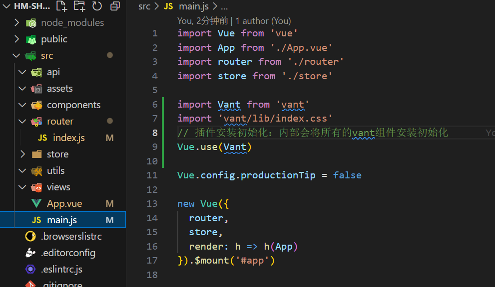
  使用的话，在官网上复制粘贴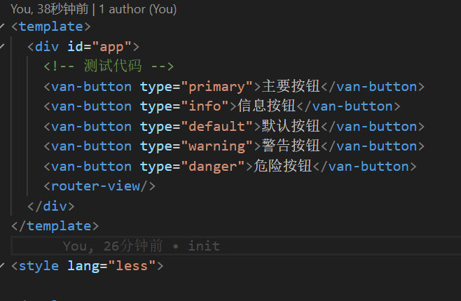
   * 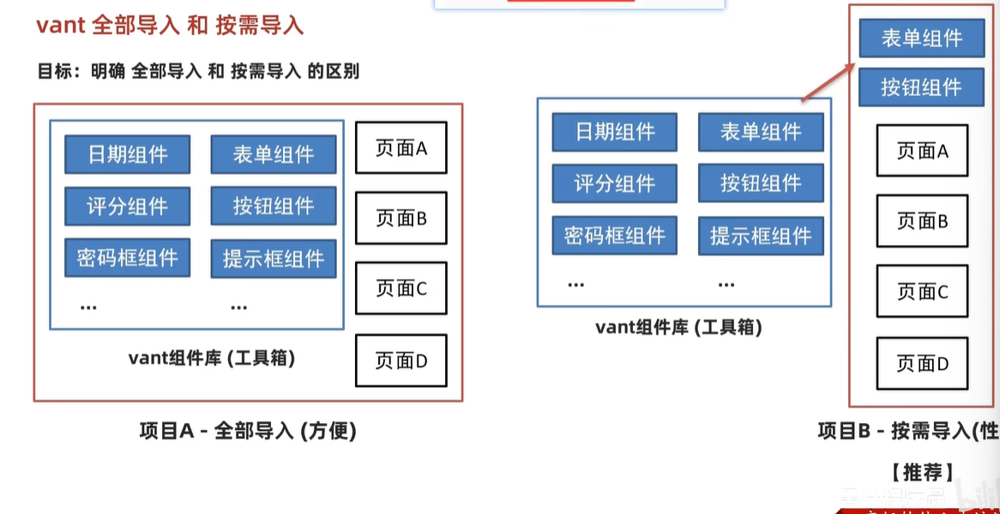

### 第四步--vw适配（移动端适配）
基于：postcss插件，实现vw适配（自己写px，自动会在内部转换成vw）
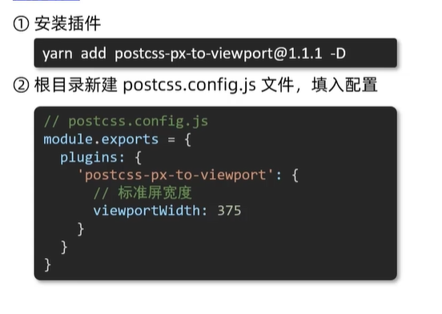

### 第五步--路由设计配置
目标：分析项目页面，设计路由，配置一级路由
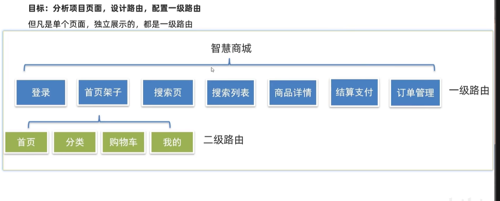


### 登录页面静态布局
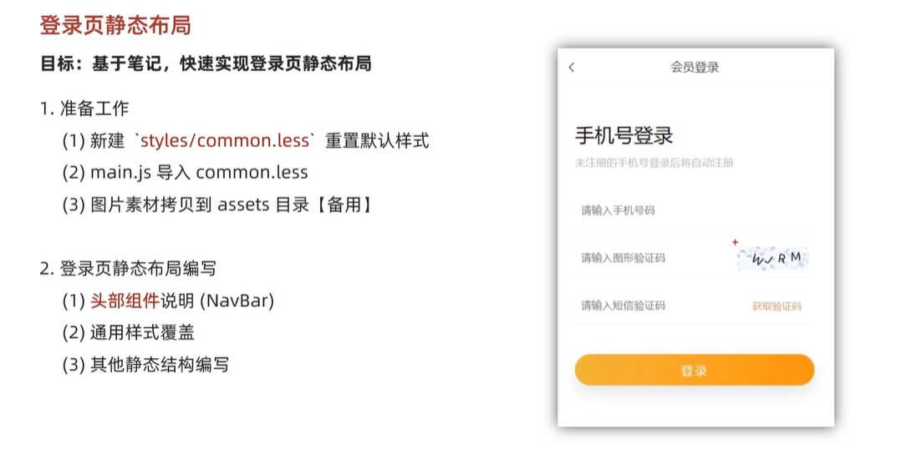

### request模块-axios 封装了不同的函数
目标：将 axios 请求方法，封装到request 模块
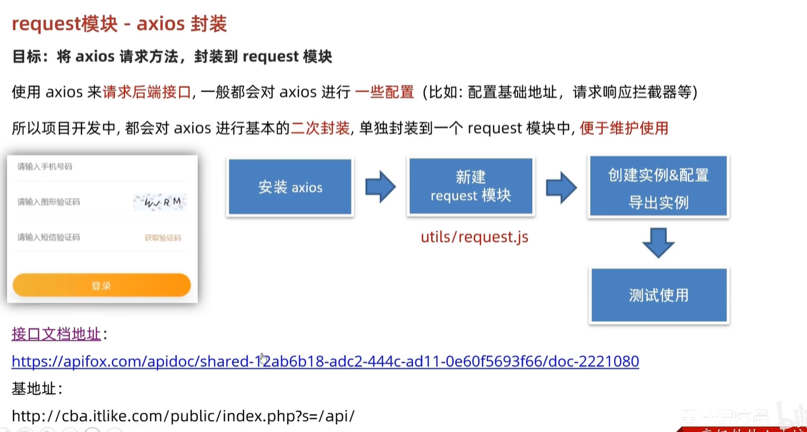

---------

### 登录-验证码、短信、手机号
1. `toast`给出个提醒（例如请输入正确的手机号、验证码）
2. 获取短信- '定时器'---关键是：
   1. 在离开页面后得销毁定时器
   2. 得使用 'timer'变量 来确定是否已经获取了，避免连续点击多次
   

### 响应式拦截器

### 登录权证信息储存
目标：vuex 构建user 模块储存登录权证（token & userId）

### storage存储模块-vuex持久化处理
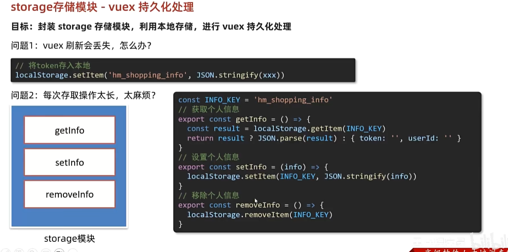

### 添加请求loading效果
目标：在每次请求后台的时候，添加请求loading效果
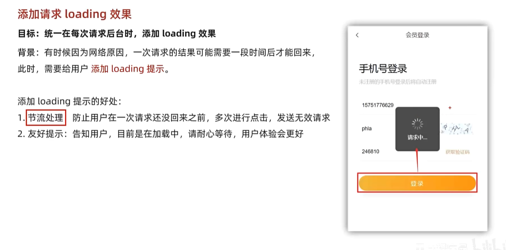


### 页面访问拦截
目标：基于全局前置守卫，进行页面访问拦截处理


路由导航守卫-**全局前置守卫**


### 打包发布
`yarn build`

注意：`Shift + Alt + F`为格式化文档 => 变得更整齐
----配置为 '相对路径'


#### 打包优化

特点是 ： 只有当我们访问对应的路由时，才会去加载对应的数据

# Vue3
## create-vue 搭建Vue3项目
1. 已安装 16.0或以上的 Node.js
2. 创建一个Vue应用 -`npm init vue@latest`

## 2.VUe3-组合式API-setup
原始复杂写法：
```html
<script>
// setup
// 1. 执行时候，setup比beforeCreate 还要早
// 2. 所以在setup中，获取不到this
// 3. 数据 和 函数 需要在setup中return 才可以在模版中使用
// 问题： 每次都需要return， 有点麻烦
export default{
  setup(){
    console.log(1);
    console.log(this); // undefined
    // 数据
    const message = 'hello, Vue3'
    // 函数
    const logMessage = () => {
      console.log(message)
    }

    return {
      message,
      logMessage
    }
  },
  beforeCreate(){
    console.log(2);
  }
}
</script>

<!-- 模版 -->

<template>
  <div>{{ message }}</div>
  <button @click="logMessage"> 按钮 </button>
</template>
```

**语法糖写法**：
```html
<script setup>
  // 4. 通过语法糖写法简化代码
  // 直接申明你需要的数据或函数
  const message = 'hello vue3'
  const logMessage = () => {
    console.log(message)
  }
</script>
```


### 3.vue3-组合式API-reactive()

作用：接受 '对象类型数据的参数传入' 并返回一个 '响应式对象'

代码演示：
```html
<script setup>
// reactive() 接受一个对象类型的数据，返回一个响应式的对象

// 第一步： 导包
import {reactive} from 'vue'

// 第二步：申明变量接受数据
const state = reactive({
  count: 100
})
const setCount = () => {
  state.count ++
}
</script>

<template>
  <div>{{ state.count }}</div>
  <button @click="setCount">+1</button>
</template>
```

#### 那如果数据是简单类型，怎么办？ ==> ref()
*ref()*:
作用：接受`简单类型或者对象类型的数据` 传入并返回一个`响应式对象`

```html
<script setup>
import { ref } from 'vue' // 第一步：导入
// 本质是：在原有传入的数据的基础上，外层包了一曾对象，包成了复杂类型
// 底层，包成复杂类型后，再借助 reactive 实现响应
// 注意： 1.访问数据，需要通过 .value
//       2. 在 template 中，.value 不需要加(帮我们扒了一层)

const count = ref(0)
console.log(count.value)
const setCount = ()=> {
  count.value ++
  // count 是个响应式对象
}
</script>

<template>
  <!-- <div>{{ count.value }}</div>   错误的！-->
  <div>{{ count }}</div> 
</template>
```

### 3.vue3-组合式API-computed
核心步骤
1. 导入 computed 函数
2. 执行函数，在回调参数中 return基于响应式数据做的计算的值，用于 变量接受


```html
<script setup>
// const 计算属性 = computed(() => {
//       return 计算返回的值
// })

// 1. 导入
import { ref, computed } from 'vue'

// 2. 申明数据
const list = ref([1,2,3,4,5,6,7,8])

// 计算属性
const computedList = computed(() => {
  return list.value.filter( item => item > 2)
})
// 注意：此时的 computedList 是只读，也就是说 computedList ++ 会报错
// 下面是创建一个可写的计算属性例子:
const num = ref(1)
const addOne = computed({
  get: () => num.value + 1,
  set: (val) => {
    num.value =val - 1
  }
})
 
addOne.value = 1 // 这里触发了 set函数执行
console.log(num.value); // 0


</script>

<template>
  <div>
    <div>原始数据 {{ list }}</div>
    <div>计算后的数据 {{ computedList }}</div>
  </div>
</template>
```

注意：
1. 计算属性不应该有 " 副作用 "
  比如 异步请求/修改dom
2. 避免直接修改计算属性的值
   计算属性应该是只读的，特殊情况下可以设置 get, set


### 4.vue3-组合式API-watch
作用: 侦听一个活多个数据的变化，数据变化时执行回调函数
两个额外的参数:
1. immedi（立即执行）
2. deep（深度监听）

监听单个数据变化·

监听多个数据变化:

**immediate**
说明：在侦听器创建时 立即触发回调，响应式数据变化后继续执行回调

**deep**


**精确侦听对象的某个属性**

1. `() => userInfo.value.age` 第一步，找 userInfo里面的 age
2. 


### 5.vue3-组合式API-生命周期函数


### 6.vue3-组合式API下的父传子

基本思想：
1. 父组件中传给 '子组件绑定属性'
2. 子组件内部通过 'props选项接受'


defineProps 原理：就是编译阶段的一个标识，实际编译器解析时，遇到后就会进行编译转换


### 7.vue3-组合式API下的子传父

基本思想：
1. 父组件中给 '子组件标签通过@绑定事件'
2. 子组件内部通过 'emit方法触发事件'

代码演示：


### 8.vue3-模版引用

通过 ref 标识获取真实的 dom对象或者组件实例对象

**如何使用？？**


 第三点 通过 ref 对象.value即可访问到被绑定的元素（必须在dom渲染完成后才可以）


**defineExpose()**


### 9.vue3-组合式API-provide 和 inject

作用：`实现跨层组件通信`


**跨层传递普通数据**


### 10.vue3新特性-defineOptions
背景：


### 11.vue3新特性-defineModel


ps:需要在`vite.config.js`中配置，再重启(`npm run dev`)


### Pinia入门

Pinia 是 Vue的最新 状态管理工具，是vuex的替代品


#### 手动添加Pinia到Vue项目


第一步：


第二步：


第三步：导入


### action异步实现


### pinia-storeToRefs方法


如果结构store中的数据会出现丢失响应式的情况，解决方法就是：使用 `storeToRefs`方法（注意得导入）


### pinia-持久化


## Vue3 大事记管理系统

### pnpm包管理-创建项目


### 路由初始化


router/index.js代码演示：
```js
import { createRouter, createWebHistory } from 'vue-router'

// createRouter 创建路由实例
// 配置 history 模式
// 1. history 模式：createWebHistory 地址栏不带 #
// 2，hash 模式：    createWebHistory 地址栏带 #
const router = createRouter({
  //  createWebHistory(): 括号里写代表访问的前缀
  // import.meta.env.BASE_URL 是 vite 中的环境变量，在vite.config.js 中配置 base 项
  history: createWebHistory(import.meta.env.BASE_URL),
  routes: []
})

export default router
```

App.vue 代码演示：
```js
<script setup>
// 在 Vue3 CompositionAPI 中
// 1. 获取路由对象 router useRouter
//    const router = useRouter ()
// 2. 获取路由参数 route useRoute
//    const route = useRoute()

import { useRouter, useRoute } from 'vue-router'
const router = useRouter()
const route = useRoute()

const goList = () => {
  // console.log(route, router)
  router.push('/list')
  console.log(route, router)
}
</script>

<template>
  <div>
    我是APP
    <button @click="$router.push('/home')">跳首页</button>
    <button @click="goList">跳列表</button>
  </div>
</template>
```

### 按需引入 Element Plus


### Pinia 构建仓库 和 持久化


把一些仓库全放在 `modules`文件夹中，再在'中间商' - `stores/index.js` 中暴露导出；最后 在App.vue中使用 只需从统一的路径 `'@/stores/index'`中导出
