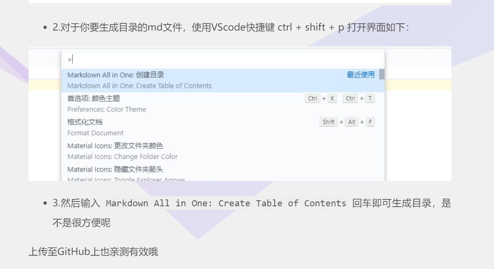

- [markdown-vscode语法](#markdown-vscode语法)
  - [将笔记上传到github上](#将笔记上传到github上)
  - [1.标题](#1标题)
  - [2.生成目录](#2生成目录)
  - [3.引用](#3引用)
  - [4.行内标记](#4行内标记)
  - [5.代码块](#5代码块)
  - [6.插入连接](#6插入连接)
  - [7.插入图片](#7插入图片)
  - [8.插入图片带有链接](#8插入图片带有链接)
  - [9.插入视频](#9插入视频)
  - [10.序列](#10序列)
  - [11.任务列表](#11任务列表)
  - [12.表情（待定）](#12表情待定)
  - [13.表格](#13表格)
  - [14.支持内嵌CSS样式](#14支持内嵌css样式)
  - [15.语义标记](#15语义标记)
  - [16.语义标签](#16语义标签)
  - [17.公式](#17公式)
  - [18.分隔符](#18分隔符)
- [Latex数学公式](#latex数学公式)

# markdown-vscode语法
## 将笔记上传到github上
首先在github上建一个仓库
然后在终端 git clone url
然后推送前需要提交
<br>
<hr>

## 1.标题
不同级别的标：若干个#+空格组成
标签
## 2.生成目录
['TOC']加回车（注意TOC旁边没有单引号的）
但是上传到github上就没有
解决方法：

## 3.引用
">"加需要引用的文字(注意 实际上是不需要双引号)
>hello world
这好像接下来的行也是引用块


两次换行即可退出
## 4.行内标记
标记之外`hello world`标记之外
（要标记的内容用``包起）
## 5.代码块
```javascript
let a = 10;
//（主要是用三对反引号扩起 然后加上代码类型，或者是不加）
```
## 6.插入连接      
```
代码：
    [](链接 '提示词')
```
[百度](http://www.baidu.com/ '百度一下')
## 7.插入图片
注意在vscode快捷键是 **ctrl+alt+v**
```
代码：
    
    如果要调整大小，可以配合html使用
```

## 8.插入图片带有链接
```dotnetcli
代码：
    [](连接)
```
## 9.插入视频
```xml
注：Markdown 语法是不支持直接插入视频的
普遍的做法是 插入 HTML 的 iframe 框架，通过网站自带的分享功能获取，如果没有可以尝试第二种方法
第二是伪造播放界面，实质是插入视频图片，然后通过点击跳转到相关页面

代码：
    <iframe height=498 width=510 src='http://player.youku.com/embed/XMjgzNzM0NTYxNg==' frameborder=0 'allowfullscreen'></iframe>

```
## 10.序列
```markdown
代码1(有序)：
    1. one
    2. two
    3. third
```
演示：
    1. first
    2. two
    3. third
```markdown
代码2(无序)：(注意空格)
    * one
    * two
    * three
```
* one
* two
* three
## 11.任务列表
```xml
代码：
        - [x] 选项一
        - [] 选项二

```  
- [x] markdown笔记
- [] 数学公式
## 12.表情（待定）
## 13.表格
```xml
注： : 代表对齐方式 
代码1：
    | a  |  b | c  |
    |:--:|:-- | --:|    #这句代码只能写在第二行
    |  居中 |  左对齐 |  右对齐 |
代码2(简约写法)：
    a  |  b  | c  
    :---:|:------------ |--:
    居中 |  左对齐 |  右对齐 
代码3(特殊表格)：使用HTML代码

```
a|b|c
:--:|:--|--:
居中|左对齐|右对齐
## 14.支持内嵌CSS样式
```xml
代码：<p style="color: #AD5D0F;font-size: 30px; font-family: '宋体';">内联样式</p>

```
<p style="color: #AD5D0F;font-size: 30px; font-family: '宋体';">内联样式</p>

## 15.语义标记
```xml
代码：
        *斜体*、_斜体_  
        **加粗**  
        ***加粗+斜体***、**_加粗+斜体_**  
        ~~删除线~~    
        ==背景色==  
        $\underline{下划线}$   
        Superscript - superscript
        ^superscript^
        Subscript - subscript
        ~subscript~

```
演示：
代码：
        *斜体*、_斜体_  
        **加粗**  
        ***加粗+斜体***、**_加粗+斜体_**  
        ~~删除线~~    
        ==背景色==  
        $\underline{下划线}$   
        Superscript - superscript
        ^superscript^
        Subscript - subscript
        ~subscript~
## 16.语义标签
```xml
    代码：
            <i>斜体</i>  
            <b>加粗</b>  
            <em>强调</em>  
            <u>下划线</u>   
            <del>删除</del>  
            Z<sup>a</sup>  
            Z<sub>a</sub>  
            <kbd>Ctrl</kbd>
```
111231
    代码：
            <i>斜体</i>  
            <b>加粗</b>  
            <em>强调</em>  
            <u>下划线</u>   
            <del>删除</del>  
            Z<sup>a</sup>  
            Z<sub>a</sub>  
            <kbd>Ctrl</kbd>

## 17.公式
```xml
    代码：
            $ x = {-b \pm \sqrt{b^2-4ac} \over 2a}. $

```
1
    代码：
            $ x = {-b \pm \sqrt{b^2-4ac} \over 2a}. $
## 18.分隔符
```xml
    代码： ---  或者  ***
```
---

# Latex数学公式
总体上说就是两个$扩起来
1. **数学符号：**
   - `^` 表示上标（例如，`x^2` 表示 x 的平方）。 
   - `_` 表示下标（例如，`a_1` 表示 a 的下标为1）。
   - `\frac{a}{b}` 表示分数，其中 a 是分子，b 是分母。
   - `\sqrt{n}` 表示平方根。
   - `\sum` 表示求和。
   - `\int` 表示积分。
   - `\infty` 表示无穷大。
$
    \frac{x^2+y_1}{\sqrt{x}}
$
1. **希腊字母：**
   - `\alpha`, `\beta`, `\gamma`, ... 表示希腊字母。

2. **关系符号：**
   - `=` 表示等于。
   - `\neq` 表示不等于。
   - `<`, `>`, `\leq`, `\geq` 分别表示小于、大于、小于等于、大于等于。

3. **集合和逻辑运算：**
   - `\cup`, `\cap` 表示并集和交集。
   - `\subset`, `\subseteq`, `\supset`, `\supseteq` 表示子集和超集。
   - `\in`, `\notin` 表示属于和不属于。

4. **矩阵：**
   - `\begin{matrix} ... \end{matrix}` 用于创建矩阵。

5. **分隔符：**
   - `{}`, `()` 表示大括号和圆括号。
   - `[]` 表示方括号。
   - `\langle`, `\rangle` 表示尖括号。


