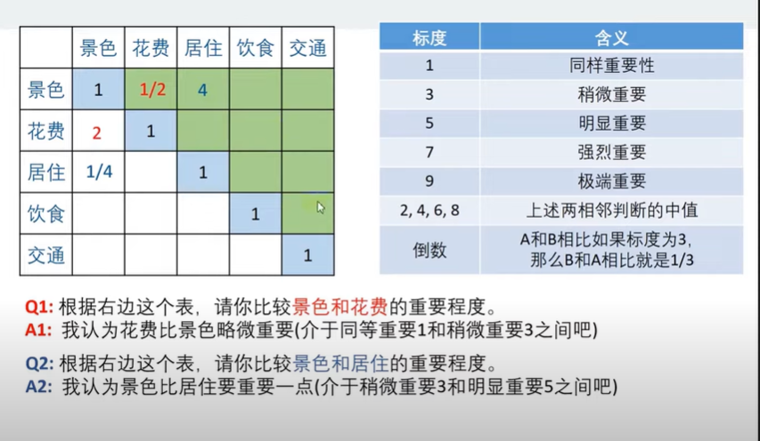

## 层次分析法
主要用于解决评价类问题-更优解、打分、评价
首先要想到的三个问题：
1. 我们评价的目标是什么
   如*：为小明选择最佳的旅游景点*
2. 为了达到这个目标有几种可选择的方案
   *三种，苏杭、北戴河、桂林*
3. 评价的准则或者说指标有什么
   *假设：景色、花费、居住、饮食、交通*
   * 可以从题目中提取
   * 可以找论文（知网）       
   * 可以从网站搜索关键词（谷歌、微信、知乎.....）
   * 小组成员讨论

||权重指标|苏杭|北戴河|桂林|
|--|--|--|--|--|
|景色
|花费
|居住
|饮食
|交通

分而治之：我们来先确定指标的权重
问题：一次性考虑五个指标可能会考虑不周
解决：**两两比较**

（实际中，这张表有“专家”填写）
这个5*5的方阵，我们记住A，对应的元素为aij,有以下特点：
1. aij的意义是，与指标j相比，i的重要性
2. 当i = j时，指标相同，同等重要记住1
3. 当aij > 0, 且满足aij x aji = 1（我们称这种矩阵为**正互反矩阵**）
实际上这个矩阵就是层次分析法中的**判断矩阵**。
 

### 一致矩阵
如果正互反矩阵满足 aij x ajk = aik,则我们称其为一致矩阵。
（在计算权重时，必须进行一致性检验）
#### 一致性检验（==待补充==）
\[
\begin{bmatrix}
  a_{11} & a_{12} & \dots & a_{1n} \\
  a_{21} & a_{22} & \dots & a_{2n} \\
  \vdots & \vdots & \ddots & \vdots \\
  a_{m1} & a_{m2} & \dots & a_{mn} \\
\end{bmatrix}
\]

### 算术平均法求权重

### 几何平均法求权重

### 特征根法求权重

### Matlab部分

