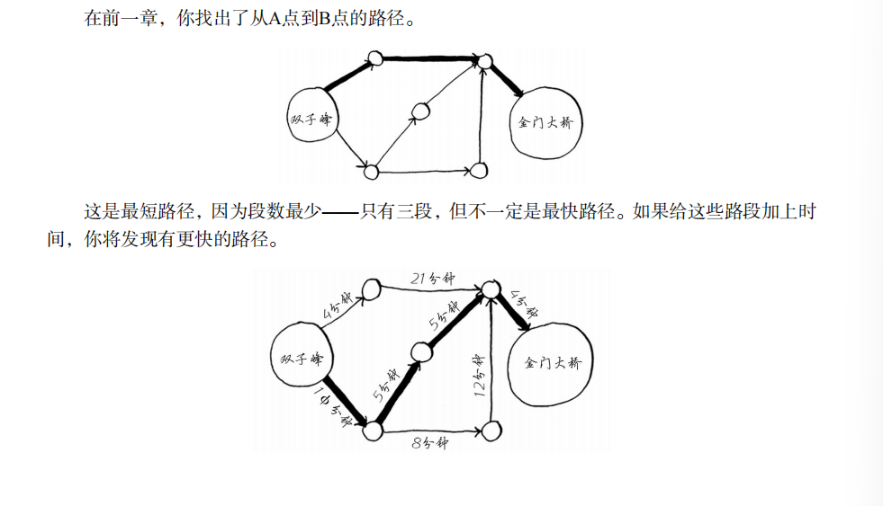
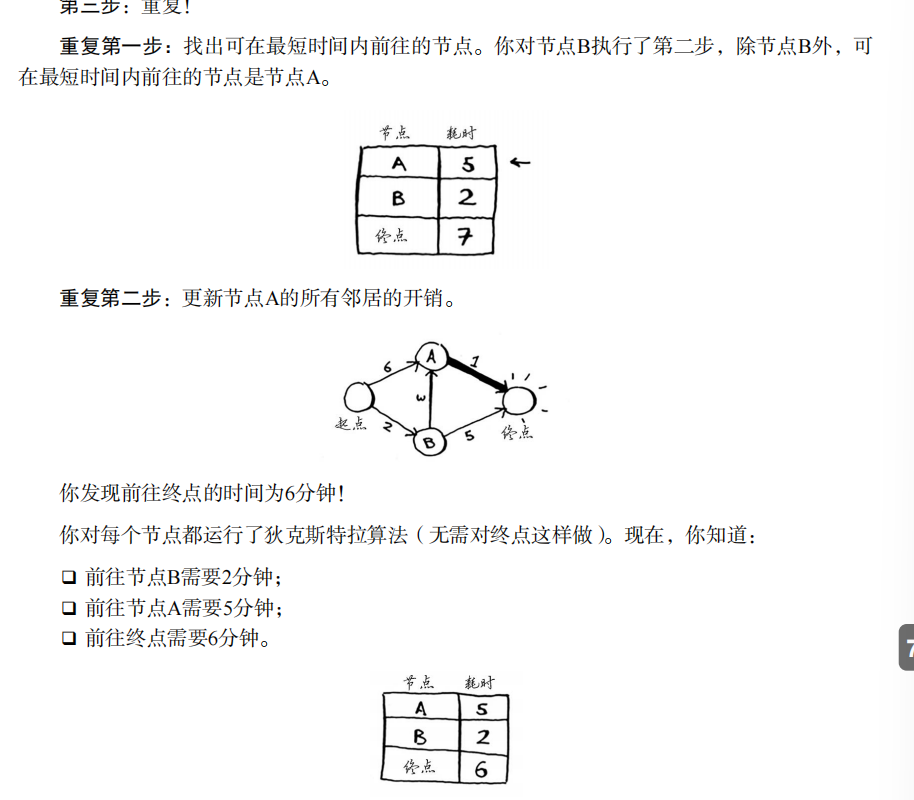

# 《 算法图解 》
## 第1章-算法简介

### 1.1二分查找法
目标：在一个有序数组中查找 某个元素是否在其中
```python
def binary_search(list, item):
    # 该函数接受一个有序数组和一个元素（查找该元素是否在数组）
    low = 0
    high = len(list) - 1

    while low <= high:
        mid = (low + high) // 2  # '//' 用于整数间的除法，会向下取整
        guess = list[mid]
        if guess == item:
            return mid
        elif guess > item:
            high = mid - 1
        else:
            low = mid + 1
    return None


my_list = [1, 3, 5, 7, 9]
print(binary_search(my_list, 3))  # => 输出 1
print(binary_search(my_list, 8))  # => 输出 None
```

### 1.2大O表示法
大O表示法指出了最糟糕情况下程序运行的时间

-------

## 第2章-选择排序

### 2.1数组和链表

**数组**：数组中的每一项在计算机内存中都是连起来的
* 会浪费内存
* 如果元素超过多少个，还需要重新挑位置
* **便于读取**，不便于 '插入'（运算时间需要O(n)）

**链表**：链表中的元素可以存储在任何地方，链表中的每个元素都存着下一个元素的地址，从而将一系列随机的地址串联起来
* 假如你需要访问链表的第三个元素，你不可用直接访问，而需要先访问元素#1，得到元素#2的地址，再访问元素#2，得到元素#3的地址，从而可以访问元素#3.———— 当年需要跳跃访问的时候，链表的效率很低
* **便于插入**，不便于 '读取'（运算时间需要O(n)）

#### 2.1.2 在中间插入-链表
如果插入在数组中，需要将后面的元素都往后移一个位置；
而插入链表中，只需要修改它前面那个元素指向的地址。

#### 2.1.3 删除-链表
如果是删除数组中的元素，需要将后面的元素都向前移；
而删除链表中的元素，只需要修改前一个的指向地址便可。

|  | 数组 | 链表
|  ---| ---  | ---
|  读取| O(1) | O(n)
|  插入| O(n) | O(1)
|  删除| O(n) | O(1)

### 2.2选择排序-$ O(n^2) $
例如从多到少，先找最大的，再找其次.....运算时间：$ O(n^2) $

先定义一个找到最小元素的函数，再将其添加到新数组中
```python
def findSmallest(arr):  # 数组中最小的元素
    smallest = arr[0]
    smallest_index = 0
    for i in range(1, len(arr)):
        if arr[i] < smallest:
            smallest = arr[i]
            smallest_index = i
    return smallest_index


def selectionSort(arr):
    newArr = []
    for i in range(len(arr)):
        smallest = findSmallest(arr)
        newArr.append(arr.pop(smallest))
        #pop()函数用于移除指定索引位置的元素，并且返回被移除的元素值
        #append() 在数组的末尾添加一个元素

    return newArr


print(selectionSort([5, 3, 6, 2, 10]))  # => 输出：[2, 3, 5, 6, 10]
```

## 第3章-递归
* 基线条件：函数不再调用自己
* 递归条件：函数调用自己

## 第4章-快速排序-$ O(n \ log n) $

### 4.1分而治之（D&C）
工作原理：
1. 找出简单的基线条件
2. 确定如何缩小问题的规模，使其符合基线条件


### 4.2 快速排序
1. 选择基准值
2. 将数组分成两个子数组（小的、大的）
3. 对这两个子数组进行快速排序

```python
def quicksort(array):
    if len(array) < 2:
        return array
    else:
        pivot = array[0]  # ---选择基准值
        less = [i for i in array[1:] if i <= pivot]

        greater = [i for i in array[1:] if i > pivot]
        return quicksort(less) + [pivot] + quicksort(greater)


print(quicksort([10, 5, 2, 4]))  # ctrl + alt + l 是格式化代码，输出 =>[2, 4, 5, 10]
```

## 第5章-散列表

### 5.1散列函数
散列函数是这样的函数，即无论你给它什么数据，它都还给你一个数字。

`散列函数`+`数组` ——> `散列表`的数据结构
Python提供的散列表实现为 '字典'，可以使用函数`dict`来创建反列表.
散列表是由 **键和值** 组成，将键映射到值

```python
book = dict()  # 一个空的散列表
book["apple"] = 0.67
book["milk"] = 1.49
book["avocado"] = 1.49
print(book)  # 输出： {'apple': 0.67, 'milk': 1.49, 'avocado': 1.49}
print(book["milk"])  # 输出： 1.49

# get函数也就可以用来检测键名是否存在

print(book.get("apple"))  # 输出： 0.67
print(book.get("text"))  # 输出： None
```


## 第6章-广度优先搜索
一般用于处理 最短路径问题
### 6.1图是什么
图由节点和边组成。通过边相连的节点，被称为 邻居。

### 6.2广度优先搜索
1. 有路径吗？
2. 哪条路径最短？

#### 6.2.1队列
队列只支持：入队和出队
队列是一种 '先进先出'的数据结构，
栈是一种 '后进先出'的数据结构


### 6.3实现图


代码实现：
```python
graph = {}
graph["you"] = ["alice", "bob", "claire"]
graph["bob"] = ["anuj", "peggy"]
```


### 6.4实现算法


但可能会出现重复检测某个人的情况，更糟糕的情况可能会导致无限循环


### 6.5运行时间
边：从一个人到另一个人的箭头或者是连接
**O(人数+边数)**也就是 **O(V+E)**，其中V是顶点数，E是边数

## 第7章-狄克斯特拉算法

前面一章，我们使用 '广度优先搜索' 找到的是路径数最少的路径；那如果要找 最快的路径呢？

### 7.1四步走：
1. 找出最便宜的节点，即可在最短时间内前往的节点
   

2. 对于该节点的邻居，检查是否有前往他们的更短路径，如果有，重新更新开销
   
3. 重复这个过程，直到对图中的每一个节点都这样做了
   
4. 计算最终路径


### 7.2换钢琴例子


### 7.3代码实现


```python
# 将节点所有邻居处理在graph散列表中
graph = {}
graph["start"] = {}
graph["start"]["a"] = 6
graph["start"]["b"] = 2

graph["a"] = {}
graph["a"]["fin"] = 1

graph["b"] = {}
graph["b"]["a"] = 3
graph["b"]["fin"] = 5

graph["fin"] = {}

# 哟个散列表costs存储每个节点的开销
infinity = float("inf")  # 定义一个无穷大
costs = {}
costs["a"] = 6
costs["b"] = 2
costs["fin"] = infinity

# 用散列表parents存储父节点
parents = {}
parents["a"] = "start"
parents["b"] = "start"
parents["fin"] = None

# 用一个数组记录处理过的节点
processed = []


def find_lowest_cost_node(costs):
    lowest_cost = float("inf")
    lowest_cost_node = None
    for node in costs:
        cost = costs[node]
        if cost < lowest_cost and node not in processed:
            lowest_cost = cost
            lowest_cost_node = node
    return lowest_cost_node


node = find_lowest_cost_node(costs)
while node is not None:
    cost = costs[node]
    neighbors = graph[node]
    for n in neighbors.keys():  # 遍历当前节点的所有邻居
        new_cost = cost + neighbors[n]
        if cost[n] > new_cost:
            costs[n] = new_cost
            parents[n] = node
    processed.append(node)
    node = find_lowest_cost_node(costs)
```

## 第8章-贪婪算法


## 第9章-动态规划
